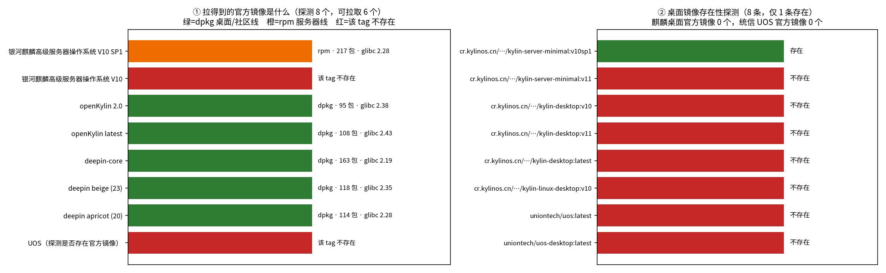
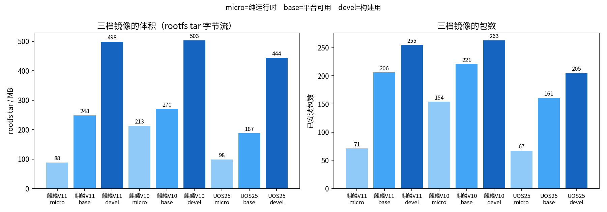
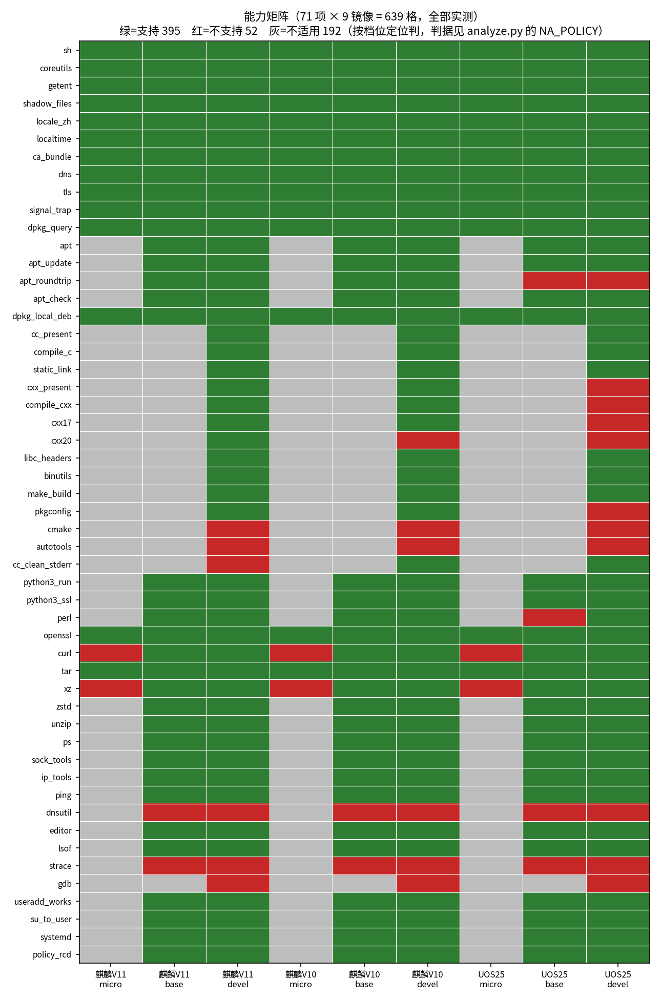

# 从 ISO 为国产桌面操作系统构建分档容器镜像

> 基准日 **2026-08-30** ｜ 国产桌面 OS 名录 **21** 个（商业 12 / 社区开源 9）｜ 构建镜像 **9** 个（3 发行版 × 3 档位）｜ 构建路径 **3** 条 ｜ 能力矩阵 **648** 格逐格判定 ｜ 验收断言 **365** 条 ｜ 变异用例 **12** 条 ｜ 机器核对断言 **306** 条（`python3 scripts/verify.py`）｜ 厂商缺陷留档 **12** 条 ｜ 一手数据集 **7** 组 ｜ 图 **6** 张（含机器无关的数据侧车 `figures/plotdata.json`）｜ 可复算表 **18** 张 ｜ 参考来源 **117** 条（GitHub 脚注，逐格 cite）

要把编译好的软件交付到客户的银河麒麟或统信 UOS 桌面上，交付前得先在那个环境里验一遍。厂商发的是 ISO，容器镜像要么没有、要么不是同一个东西。本仓库把「从桌面版 ISO 自己造分档镜像」这件事做通并留下完整证据：三条构建路径、九个镜像、648 格逐格判定的能力矩阵、五道验收门禁。

**完整报告：[`report.md`](report.md)**



---

## 1. 主要结论

| # | 结论 | 证据 |
|---|---|---|
| 1 | **麒麟「有官方容器镜像」是个误读。** `cr.kylinos.cn` 上匿名可拉的唯一镜像是 `kylin-server-minimal:v10sp1`，它是 **rpm** 包格式、glibc `2.28-36.1.p24.ky10`、软件源在 `update.cs2c.com.cn`；而桌面 V10/V11 是 **dpkg**、glibc `2.31-0kylin9.1k20.3` / `2.38-1ok6.9k0.5`、源在 `archive.kylinos.cn`。包格式、glibc、软件源三样全不同 | [§2.1](report.md#23-麒麟有官方镜像是个误读那是另一条产品线)、`fig02`、[`t03`](derived/tables/t03_product_line_comparison.csv) |
| 2 | **误读的技术根源是一个字段：两者 `os-release` 的 `ID` 都是 `kylin`。** 按 `ID` 判发行版是常见做法，而这个字段在这里不具备区分力，得看 `NAME` 或包格式 | [§2.1](report.md#23-麒麟有官方镜像是个误读那是另一条产品线)、`os_id_collision=True` |
| 3 | **国产桌面 OS 里没有一个有桌面版官方容器镜像。** 名录 21 个 OS（商业 12 / 社区开源 9）、42 个候选引用实测 18 个存在，但带 `desktop`/`ukui`/`dde` 字样的 **13 条跨 5 家 registry 一条都不存在**。更强的一格：直接枚举厂商自己的 registry——`cr.kylinos.cn` 的 `kylin` 项目 27 个仓库全列出、含 desktop 或 ukui 的 **0 个**；`registry.uniontech.com` **18 个公开项目、0 个桌面相关**，基础镜像项目名就叫 `uos-server-base`。唯一例外是 openEuler DevStation 的 1.92 GiB rootfs，而它不在任何 registry、只有一个版本 | [§2](report.md#2-国产桌面-os-的分布与官方容器镜像现状)、[`t02`](derived/tables/t02_registry_existence_probes.csv) |
| 4 | **一条 ISO 一条路。** 三个被试没有一条通用路径：V11 走 `mmdebstrap`，V10 因 debconf 依赖环 + 宿主 dpkg 1.22 与目标 1.19.7 的代差只能两阶段自举，UOS V25 是 OSTree 不可变系统只能从 squashfs 按包依赖闭包切片 | [§4](report.md#4-三条构建路径)、[`t09`](derived/tables/t09_build_paths.csv) |
| 5 | **UOS V25 不能作为 C++ 构建环境。** 它的 ISO（1636 个包）里没有 g++，而它没有 apt 形式的 OS 软件源（源索引只有 2496 个条目、全来自应用商店，连 `nano` 都查不到候选），所以装不上。三个 devel 档 C 全通过，C++ 只有两家 | [§6.3](report.md#63-一个必须讲清的区别麒麟的没预装与-uos-的硬缺口) |
| 6 | **麒麟的「没预装」与 UOS 的「硬缺口」性质完全不同。** 14 个常见工具的源内可装性：麒麟 V11 **14 / 14**、麒麟 V10 **14 / 14**、UOS V25 **0 / 14**（判据用 `apt-cache madison` 而非 `policy` 的 Candidate，后者会把「已经装了」误计成「装得上」） | [§6.3](report.md#63-一个必须讲清的区别麒麟的没预装与-uos-的硬缺口) |
| 7 | **dpkg 段错误的真根因是厂商的安全插件，不是 IO 选项。** 麒麟 V11 的 `kysec2-package-plugins` 往 `/var/lib/dpkg/plugins/` 装两个依赖内核态 KYSEC LSM 的 `.so`，而麒麟给 dpkg 打了补丁去 dlopen 它们。此前三次归因全错，其中一次是受控实验里的状态污染 | [§9.2](report.md#92-被推翻的判断与踩过的坑)、缺陷 D02 |
| 8 | **加包要看真实代价。** 为补一个 `dig` 会经 `bind9-libs` 拖进 `libicu74`（36 MB），麒麟 V11 base 从 345 MB 涨到 407 MB；UOS base 补 `perl` 从约 281 MB 涨到 420 MB。两项都已回退。⚠️ 这四个数用 `docker images` 解包口径，与本仓库其余处的 rootfs tar 口径不同；只有起点 345 MB 有现存锚点，其余是回退前的一次性观察 | [§5.1](report.md#51-加包要看真实代价) |
| 9 | **检查框架自己会假通过，所以门禁本身也要被门禁。** 本项目实测到三类：helper 函数未定义导致两条分支都是「命令未找到」、检查脚本挂死导致输出截断而缺失 key 被读成空值、负向断言不核对失败原因等于永真 | [§9.2](report.md#92-被推翻的判断与踩过的坑) |
| 10 | **通用漏洞扫描器对这三个发行版没有有效覆盖：实测 9 个镜像有效覆盖 0 个。** 麒麟 V11 三档被 trivy 判为 `none` 根本没扫，麒麟 V10 与 UOS 六档被**误判成 Debian**——拿厂商改过的版本号比 Debian 公告区间，比不出来就报 0（九镜像 HIGH/CRITICAL 合计为 0）。那是「没有数据」，不是「没有漏洞」 | [§9.1](report.md#91-局限)、[`t13`](derived/tables/t13_cve_coverage.csv) |

> 被试为什么是银河麒麟桌面 V10 SP1 / V11 与统信 UOS V25、这套做法对名录里其他 OS 的借鉴程度、以及哪几个还值得做对标镜像（方德与 Loongnix 优先），见 [report §2.4](report.md#24-为什么被试是银河麒麟与统信-uos以及这套做法对其他-os-意味着什么)。

## 2. 九个镜像

| 发行版 | 构建路径 | micro | base | devel |
|---|---|---|---|---|
| 银河麒麟桌面 V11 | `mmdebstrap` | 88 MB / 71 包 | 248 MB / 206 包 | 498 MB / 255 包 |
| 银河麒麟桌面 V10 SP1 | `selfhost` 两阶段自举 | 213 MB / 154 包 | 270 MB / 221 包 | 503 MB / 263 包 |
| 统信 UOS V25 | `slice` squashfs 切片 | 98 MB / 67 包 | 191 MB / 164 包 | 448 MB / 208 包 |

尺寸为 rootfs tar 的字节流（构建的直接产物，被 manifest 的 sha256 锚定）。`docker images` 显示的是解包后按块占用，比它大四成上下（九个镜像实测 37.9%–46.9%，分母用 tar 精确字节、分子取 `docker images` 报的 MB），两个口径不能混用。

档位定位：`micro` 纯运行时（把别处编好的产物拷进来跑）、`base` 平台可用（有包管理、能排查）、`devel` 构建用（工具链齐备）。



## 3. 能力矩阵

72 项 × 9 镜像 = 648 格，全部由镜像内探针逐格判定（其中 15 格是「前置条件不存在」：9 格为 micro 档的 apt 三项、6 格为无编译器时的 `cc_clean_stderr`，见 report §6.1）：编译要真编译真执行，TLS 要真握手，apt 要真装真卸。支持 398 格、缺口 52 格、不适用 198 格。



三态判据（`scripts/analyze.py` 的 `NA_POLICY`）是矩阵表与热力图的唯一真源：**不适用**只在档位定位下确实不存在该需求时才用，不拿它掩盖缺口。

## 4. 验收

| 门禁 | 结果 | 防的是什么 |
|---|---|---|
| `make verify` | 365 通过 / 0 失败（基线 360） | 逐镜像结构、完整性、基线对账、能力、ABI gate、元数据 |
| `make digest-chain` | 9 / 9 | manifest 记的 sha256 与 tar、镜像三者脱钩 |
| `make sbom` | 9 / 9 | SBOM 静默失效（扫出来是空的却报成功） |
| `make mutation` | 12 抓到 / 0 漏 / 1 跳过 | 检查集本身失效（「检查永远为真」的假通过） |
| `make repro` | 6 / 6 逐位一致 | 构建不可复现 |

## 5. 复现

> ⚠️ 本地 `make verify` 只做镜像层验收，**不重新导出** `raw/d3_capabilities.json` 与 `raw/d4_gates.json`——这两份是从 `artifacts/` 里的探针输出与门禁日志导出的，改了日志而不重导不会有任何东西报警。CI（`.github/workflows/verify.yml`）会重导这两份并比对漂移，所以本地改完请一并跑 `python3 scripts/collect_d3_capabilities.py` 与 `collect_d4_gates.py`，或直接依赖 CI 兜住。

仓库不含镜像与 ISO（体积原因），但含完整构建链路。换一台 Linux 机器：

```bash
# 0) 前提：docker（rootless 亦可）、python3、能访问三个发行版的官方软件源。
#    UOS 走切片路径，需要它的 squashfs：默认由 tools/fetch-squashfs.py 用 HTTP Range
#    从 distros/uos25.conf 里的 ISO_URL 远程抽取（不下整个 ISO）；离线环境请自备 ISO
#    并把 squashfs 放到 conf 指定位置，其 sha256 必须与 SQUASHFS_SHA256 相符。
#    只重算分析与图表的话还需要：pip install -r requirements.txt，以及 CJK 字体
#    （Debian/Ubuntu：apt install fonts-noto-cjk），否则图上中文会变成方框。

# 1) 构建 builder 镜像（Debian 13 + mmdebstrap/debootstrap/squashfs-tools/gpgv）
make builder-image

# 2) 本地源：重打 libboundscheck（去掉误写成 Depends 的编译器依赖）+ 生成容器假包
make localrepo

# 3) 三条路径分别构建（各自的选择依据见 report.md §4）
make kylin11        # mmdebstrap
make kylin10        # selfhost 两阶段自举，跑在宿主上
make uos25          # slice；该目标已包含 uos25-src（在 builder 里备好切片源）

# 4) 导入 docker 并打 LABEL / STOPSIGNAL
make import

# 5) 审计与验收
make manifest verify digest-chain sbom mutation mutation-docs
```

只重算分析与图表（不需要镜像，CI 走的就是这条）：

```bash
python3 scripts/analyze.py && python3 scripts/plot.py && python3 scripts/verify.py
```

重跑采集（需要九个镜像已在本地 docker 里）。采集脚本默认从仓库自身的 `out/` 读构建产物；产物在别处就用 `DOSBUILD_OUT` 指过去：

```bash
export DOSBUILD_OUT=/path/to/out          # 存放 *.tar / *.manifest / caps-*.txt 的目录
python3 scripts/collect_d1_official_images.py   # 需要访问 registry
python3 scripts/collect_d2_our_images.py
python3 scripts/collect_d3_capabilities.py      # 加 --run 可现场重跑探针
python3 scripts/collect_d4_gates.py
python3 scripts/collect_d5_iso_and_defects.py
python3 scripts/collect_d6_installability.py    # 需要九个镜像 + builder 容器
python3 scripts/collect_d7_cve.py               # 需要本地有 aquasec/trivy 镜像
```

六个在容器内跑的脚本（`lib/common.sh`、`build/{build,customize,setup}.sh`、`tools/{mk-localrepo,prepare-slice-src}.sh`）的 `ROOT` 默认是 `/w`（builder 里的挂载点），宿主侧直接单跑会找不到文件；宿主上跑的脚本 `ROOT` 默认取仓库根（由脚本自身位置推出），不需要按开发机路径改动。

## 6. 目录结构

```
report.md                     学术正文（问题 → 官方镜像现状 → 分档 → 三条构建路径 →
                              精简与改造 → 能力矩阵 → 验收 → 可复现性 → 局限与过程记录）
distros/                      三个发行版的构建参数：源、套件、期望 ABI 基线、档位包集、
  kylin11.conf                  以及每个厂商缺陷的绕法与理由
  kylin10.conf
  uos25.conf
build/                        构建入口
  build.sh                      mmdebstrap 与 slice 两条路径
  build-selfhost.sh             麒麟 V10 的两阶段自举（跑在宿主上）
  selfhost-inner.sh             自举第二阶段，在目标容器内用麒麟自己的 dpkg 完成
  customize.sh                  mmdebstrap 的 customize hook
  import.sh                     导入 docker 并打元数据
lib/common.sh                 三条路径共用的容器化改造：policy-rc.d、apt 精简、
                              systemd 桌面语义改 server、影子文件补齐、时区、可复现打包
tools/
  slice.py                      按包依赖闭包从 squashfs 切片（UOS 路径核心）
  restore-alternatives.py       补回 update-alternatives 符号链接（不属于任何包，切片必漏）
  mk-localrepo.sh               重打包 + 生成容器假包
  gen-manifest.sh               产物清单：精确包版本 + tarball/InRelease sha256 + epoch
  render-capabilities.py        把探针输出渲染成能力矩阵
test/
  verify.sh                     全量验收（365 项，含检查总数基线断言）
  inner-checks.sh               在被测镜像内运行的检查集，结尾有完成哨兵
  capabilities.sh               能力探针：79 项全部真跑（其中 72 项进三态矩阵，6 项是环境指纹、1 项是完成哨兵）
  run-capabilities.sh           把探针跑遍九个镜像
  mutation.sh                   变异测试（镜像层）：故意破坏镜像，确认检查集真的会失败
  mutation-docs.sh              变异测试（分析层）：改坏 stats/正文/凭据，确认 verify.py 真的会失败
  digest-chain.sh               manifest = tar = 镜像 三者对账
  sbom.sh / cve.sh / repro.sh   SBOM 门禁 / CVE（含覆盖度诚实性判据）/ 可复现性凭据
gate/                         ABI 门禁二进制与其构建记录（build-gates.sh）
keys/                         麒麟 archive GPG keyring（来源与指纹见 report.md）
raw/                          一手数据，采集脚本的原始输出逐字保存
  d1_official_images.json       官方镜像可获得性与存在性探测
  d2_our_images.json            九个自建镜像的事实 + 官方镜像产品线对照
  d3_capabilities.json          能力探针原始输出（每镜像 82 个 key = 79 项探针 + 3 项采集侧 provenance；三态矩阵取 72 项 = 648 格）
  d4_gates.json                 五道门禁结果与九份 manifest 的审计锚点
  d5_iso_and_defects.json       三条路径的配置事实 + 12 条厂商缺陷
  d6_installability.json        14 个工具在各自源里的可装性、UOS 源规模与 ISO 包清单
  d7_cve.json                   漏洞扫描器对九个镜像的覆盖判定（有效覆盖／误判／未识别）
derived/                      从 raw/ 重算，不手写
  stats.json                    正文引用的全部统计量
  tables/*.csv                  17 张可复算表（含 t14 国产桌面 OS 名录、t14b 名录完整原文、t15 镜像实测）
figures/*.png                 6 张图
figures/plotdata.json         每张图实际画进去的数值与文字（机器无关，CI 拿它防「图画着旧数据」）
artifacts/                    审计凭据：九份 manifest、可复现性凭据、九份探针原始输出、
                              四份门禁日志（f4-verify/digest/sbom/mutation.log，一手输出可核对）
scripts/                      collect_d*.py 只采集不判断；analyze.py 只读 raw 只写 derived；
                              plot.py 只读 derived；verify.py 机器核对正文里的每个声明
```

## 7. 相关工作

同 org 的 [`cn-desktop-os-buildchain-study`](https://github.com/hansbug-research/cn-desktop-os-buildchain-study) 研究的是「用哪个基座编、能落到哪些国产桌面上」的 ABI 选型，被试是既有镜像；本仓库研究的是「目标环境本身怎么造出来」。两者结论互补：前者结论 7 指出厂商 server 镜像可作为对应桌面版的 **ABI 预检代理**，本仓库 §2.1 指出它**不是**桌面版的等价环境——符号地板的单向预检与用户态环境的一致复现是两个不同强度的需求。

## 8. 许可

代码 MIT，文档与数据 CC BY 4.0。三个发行版的 ISO、软件包与 GPG keyring 版权归各厂商所有，本仓库不分发它们。
