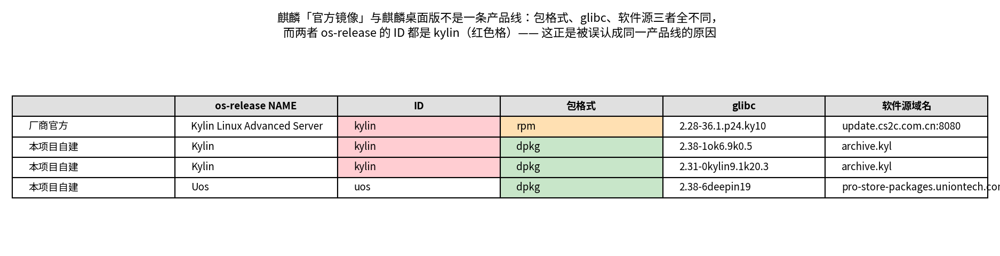
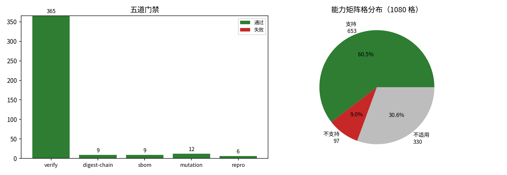
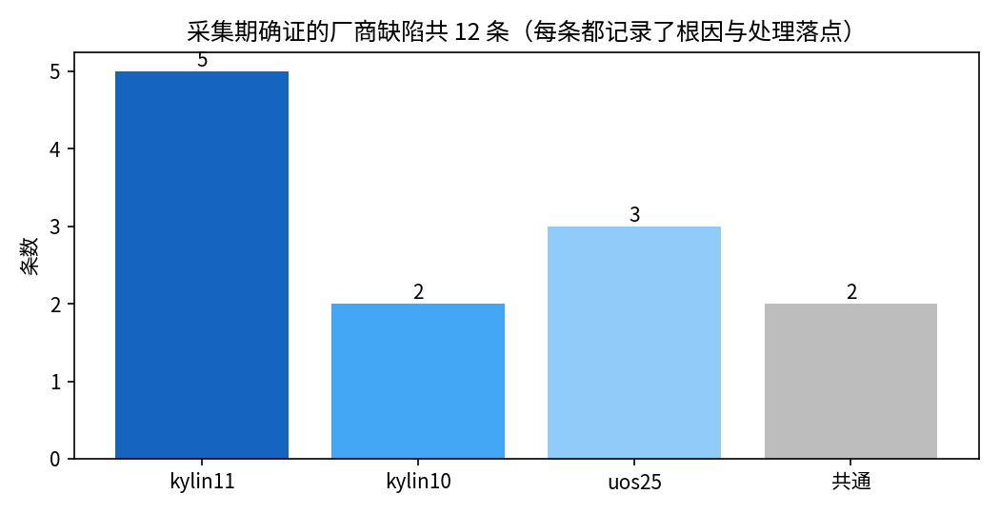

# 从 ISO 为国产桌面操作系统构建分档容器镜像

> 基准日 **2026-08-30** ｜ 构建镜像 **9** 个（3 发行版 × 3 档位）｜ 构建路径 **3** 条 ｜ 能力矩阵 **648** 格 ｜ 验收断言 **365** 条 ｜ 机器核对断言 **269** 条 ｜ 变异用例 **12** 条 ｜ 厂商缺陷留档 **12** 条 ｜ 一手数据集 **7** 组 ｜ 图 **6** 张 ｜ 可复算表 **18** 张 ｜ 参考来源 **83** 条

## 1. 问题

一份编译好的软件要交付到客户的国产桌面系统上，交付前得先验证它在那个环境里跑不跑得起来。理想做法是拿一台装着目标系统的机器实跑，但机器数量和版本组合很快就不够用；退而求其次的做法是把目标系统做成容器镜像，让验证跑在 CI 里。

问题在于，能直接拿来用的镜像并不存在。厂商发布的是 ISO 安装介质，容器镜像要么没有，要么不是同一个东西。本项目要回答的是：能不能从厂商的桌面版发行物出发，自己构建出与真机高度一致的分档镜像，让它同时承担三类用途——验证编译产物能否运行、为需要现场编译的场景提供工具链、以及作为一个包管理可用的平台基座。

仓库名与标题里的「从 ISO」需要一处校正，否则会误导复核者：**三个被试的内容来源并不相同**。统信 UOS V25 确实是从 ISO 出发——它的 rootfs 逐文件切自 ISO 内的 squashfs。银河麒麟 V10 SP1 与 V11 的内容取自厂商**在线 apt 源**（`archive.kylinos.cn`），ISO 在这两条路上只用来取 ABI 期望基线（见 `distros/kylin11.conf` 的顶部注释），并不提供 rootfs 内容。所以一个手里只有 ISO、没有源访问的复核者，能复现的是 UOS 那一条，麒麟两条跑不动；反之只有源访问、没有 UOS ISO 的人，能复现麒麟两条。§4 每条路径的第一句都写明了它实际从哪里取内容。

这里的「一致」有明确边界。容器共享宿主内核，所以内核态的东西（LSM、驱动、initramfs）一律不在一致性范围内；我们要的一致是用户态的一致：同一套 libc 与 libstdc++ 版本、同一套厂商补丁过的系统库、同一套软件源与包数据库、同一套 locale 与证书。这个边界决定了后面所有取舍。

## 2. 国产桌面 OS 的分布与官方容器镜像现状

要说清「官方镜像不够用所以自己造」，先得把**分母**摆出来：国产桌面 OS 到底有哪些。这一节先立名录，再逐个看它们的容器镜像现状。

本节的证据分两类，强度不同，在两张表里分开呈现，不合并：

- **文献事实**（表 [`t14`](derived/tables/t14_os_census.csv)）——产品名、厂商、血统、版本、桌面环境、维护状态。这些拿不到一手测量，只能引官网、发布公告与镜像站目录页，所以名录里**每一条都带出处 URL**，`config/os_census.json` 是它的可核对源文件，采集脚本会拒收任何缺 `sources` 的条目。
- **我们的实测**（表 [`t15`](derived/tables/t15_os_image_probes.csv)）——某个镜像引用到底存不存在、拉到之后里面是什么。判据是 `docker manifest inspect` 的**退出码**（用它而不是 `docker pull`，是因为要探几十个引用，pull 会把层真下下来，代价与目的不成比例；而字符串匹配判存在会把「不存在」判成「存在」，报错信息里同样含镜像引用，本项目实际踩过这个假阳性）。

### 2.1 名录：主要的国产桌面 OS

名录含 **21 个** OS：商业 **12 个**、社区开源 **9 个**。**★ 标记的两个是本项目的被试**（下面 §2.4 说明为什么选它们）。可核对的源文件是 [`config/os_census.json`](config/os_census.json)，采集脚本拒收任何缺 `sources` 的条目，`verify.py` 另有一条断言要求「缺出处的条目集合为空」。表里为可读性用了紧凑措辞，每格的完整原文在表 [`t14b`](derived/tables/t14b_os_census_detail.csv)。**每个单元格末尾的上标编号是支撑该格的引用**（GitHub 原生脚注 `[^Rn]`，点击跳到文末 Footnotes 区，共 83 条，定义见附录 C，可复算副本见表 [`t16`](derived/tables/t16_references.csv)）；名录里共 99 处字段级引用，`verify.py` 断言其中没有一处悬空。

| | OS | 类型 | 厂商/主导方 | 技术血统 | 最新版本 | 桌面环境 | 维护 | 官方容器镜像 | 其他 |
|---|---|---|---|---|---|---|---|---|---|
| ★ | **银河麒麟桌面操作系统** | 商业 | 麒麟软件有限公司（中国电子 CEC 旗下） | Debian/Ubuntu 系（⚠️ 官方未声明，注 1）[^R64][^R65] | V11（2025-08）/ V10 SP1 2503（2025-04）[^R76][^R64] | V10 SP1 = UKUI；V11 未公开（注 2）[^R64] | 活跃 | 未公开[^R7][^R8] | — |
| ★ | **统信桌面操作系统 V25（UOS）** | 商业 | 统信软件技术有限公司（UnionTech） | Debian 系（⚠️ 官方未书面确认，注 3）[^R14] | V25（2026-04-15）；V20 线 1070u4[^R53] | DDE（V25 起 Treeland + Qt6）[^R53] | 活跃 | 未公开[^R80][^R46][^R47] | — |
|  | **openKylin（开放麒麟）** | 社区开源 | openKylin 社区 | Debian 系[^R40] | 3.0「黄河」（2026-08-28）[^R73] | UKUI 4.24（⚠️ 桌面 ISO 仅三架构，注 4）[^R73] | 活跃 | 未公开[^R74][^R16][^R30] | — |
|  | **deepin（深度）** | 社区开源 | 深度科技 / deepin 社区 | Debian 系[^R4] | 25.2.1（2026-08-04，仅在线更新）[^R57][^R4] | DDE 7.0 + Treeland[^R57] | 活跃 | 未公开[^R31] | [^R14] |
|  | **openEuler** | 社区开源 | openEuler 社区 | 独立选型，rpm/dnf[^R71] | 24.03 LTS SP4（2026-06-30）[^R71] | 无桌面 ISO；桌面以包提供 / DevStation = GNOME（注 5）[^R13][^R49] | 活跃 | 未公开[^R32][^R17][^R48] | — |
|  | **麒麟信安操作系统（KylinSec）** | 商业 | 湖南麒麟信安科技 | openEuler 系[^R72] | V6 SP1（2026-06）[^R72] | 自研 Kiran / KiranUI[^R66] | 活跃 | 未公开 | — |
|  | **方德桌面操作系统 V5.0** | 商业 | 中科方德软件有限公司 | deb 系（⚠️ 官方未声明，注 6）[^R50] | V5.0（2022-06）；Pro 版 2025-09 过评[^R63][^R70] | ⚠️ 未公开（疑 MATE 衍生）[^R50] | 活跃 | 未公开 | — |
|  | **Ubuntu Kylin（优麒麟）** | 社区开源 | Canonical / 麒麟软件 CCN 联合实验室 | Ubuntu 直系[^R5] | 26.04.1 LTS（2026-08-27，支持 3 年）[^R6][^R79] | UKUI[^R78] | 活跃 | 未公开 | — |
|  | **Loongnix（龙芯）** | 社区开源 | 龙芯中科 / Loongnix 社区 | Debian 系（25 线⚠️推断 trixie，注 7）[^R69] | 25.1（2026-08-20）/ 20.7（2026-07-17）[^R69] | KDE[^R69] | 活跃 | 未公开[^R9] | — |
|  | **凝思安全操作系统** | 商业 | 北京凝思软件股份有限公司 | Debian 系（证据最硬，注 8）[^R67] | V6.0.80-20250816；并行 V6.0.100[^R67] | ⚠️ 无桌面版产品名，可选 GNOME/KDE/MATE/XFCE[^R67] | 活跃 | 未公开 | [^R68] |
|  | **Anolis OS（龙蜥）** | 社区开源 | OpenAnolis 龙蜥社区 | RHEL 兼容系[^R44] | 23.5（官方公告未同步）[^R41] | 无桌面 ISO；有独立 DDE 仓库[^R42][^R41] | 活跃 | 未公开[^R18][^R33] | — |
|  | **OpenCloudOS** | 社区开源 | OpenCloudOS 社区 | 自主演进，RHEL 系包管理[^R11] | 9.6（2026-07-13）[^R43][^R11] | 无桌面 ISO；文档有 GNOME 43 装法 / EX-NDE[^R12][^R19] | 活跃 | 未公开[^R34] | — |
|  | **新支点桌面操作系统（NewStart NSDL）** | 商业 | 广东中兴新支点技术有限公司（中兴通讯全资子公司） | ⚠️ 未查到官方结论[^R83] | V4.5.2（⚠️ 官方未标日期）[^R59] | EX-NDE 超凡桌面（Qt 自研）[^R60][^R19] | ⚠️ 品牌活跃 | 未公开 | — |
|  | **AOSC OS（安同 OS）** | 社区开源 | 安同开源社区 | 完全独立自建，自研 oma[^R1] | 滚动（下载页 2026-06-21）[^R1] | KDE Plasma[^R1] | 活跃 | 未公开[^R35][^R20] | — |
|  | **RevyOS** | 社区开源 | 中科院软件所 PLCT Lab / RuyiSDK | Debian 13 trixie；RISC-V[^R39] | 镜像站 20260504（文档滞后）[^R82] | Xfce4[^R82] | 活跃 | 未公开 | [^R51] |
|  | **Bianbu OS** | 商业 | 进迭时空 SpacemiT | Ubuntu 26.04；RISC-V[^R2] | v4.0.6（2026-08-26）[^R2] | ⚠️ 未核实[^R2] | 活跃 | 未公开 | — |
|  | **FydeOS** | 商业 | 燧炻创新 / Fyde Innovations（⚠️ 工商全称未核实） | Chromium OS + Gentoo Portage[^R45][^R21] | v23（openFyde r144）[^R15] | ChromeOS 风格自研 shell[^R45] | 活跃 | 未公开 | — |
|  | **普华桌面操作系统** | 商业 | 普华基础软件股份有限公司（中国电科投资设立） | ⚠️ 官方未声明[^R62] | ⚠️ 官方两处不一致：V4.0 / V5.0（注 9）[^R61][^R54] | V4.1 = KDE 5.4；V5.0 未查到[^R61] | ⚠️ 桌面线沉寂但未 EOL | 未公开 | — |
|  | **中标麒麟桌面操作系统（NeoKylin）** | 商业 | 中标软件有限公司 → 现运营主体为麒麟软件有限公司 | ⚠️ 未查到；历史被归为 RHEL 系[^R81] | ⚠️ 未查到 V7 之后新版本[^R81] | 未查到[^R81] | 停更 | 未公开[^R36][^R37] | [^R10] |
|  | **一铭桌面操作系统（EmindDesktop）** | 商业 | 一铭软件股份有限公司（新三板 831266） | ⚠️ 官方未声明[^R58] | 4.0 SP1（2016-06）[^R55] | 未查到[^R58] | ⚠️ 疑似停止 | 未公开 | — |
|  | **EulerOS（华为）** | 商业 | 华为 | openEuler 商业/闭源对应物[^R72] | 未公开[^R72] | 未见桌面版[^R72] | 活跃 | 未公开 | — |

**表下注**（编号对应表中「注 N」）：

1. 银河麒麟 V10 SP1 实测为 deb/apt、`ID_LIKE=debian`；V11 官网只写「基于全新内核开发」+ 磐石架构 + 开明包格式 + OSTree 原子更新，全文不提上游发行版，但出现「一键转换 deb 包为开明包」，间接指向 deb 底座。流传的「V11 桌面基于 openKylin」未找到任何一手出处，按未证实处理。
2. 官网 V11 产品页全文不出现 UKUI 字样，只写「新桌面、新壁纸、新屏保」。
3. 统信官方话语体系只讲 DTK + Qt 与内核版本（V20 线 4.19/5.10，V25 线 6.6），全程不提 Debian；业界共识为 Debian 系。其社区上游 deepin 自 23 起已自建独立基础仓库。
4. openKylin 3.0 桌面 ISO 只有 x86_64/arm64/loong64，RISC-V 侧只有嵌入式镜像（`openKylin-Embedded-V3.0-Release-spacemit-k3-riscv64.zip`），与公告宣称的「四架构支持」不完全一致。
5. openEuler 主线无桌面 ISO，UKUI/DDE/Kiran 以软件包提供（早期还有 GNOME 与 Xfce，文档已相继下架）；官方开发者桌面形态 DevStation 的桌面环境是 GNOME（依据 25.09 版 ISO 的 `.rpmlist`）。
6. 方德官方只说「基于核高基重大专项安全加固内核成果持续优化发展」；旁证是官方源 `repos.os.nfschina.com/debian-sign/` 内含 `mate-desktop-environment` 等 deb 包。
7. Loongnix 两条产品线的 `dists/*/Release` **都误写** `Origin: Debian` / `Version: 10.4`，照着读会把 25 线判成 Debian 10；按 pool 里 `bash 5.2.37-2`、`libc-bin 2.41-13` 推断实为 Debian 13 trixie（官方无声明）。
8. 凝思是本名录里血统证据最硬的一条：官方 V6.0.80 发布说明写 `grub2` 升级到 `2.06-3~deb10u4linx5`（`deb10` 即 Debian 10 buster），官方文档另有 `iceweasel`（Debian 独有的 Firefox 改名）+ glibc 2.28 组合。
9. 普华官网产品详情页写 V4.0（4.4 内核，V4.0 系列发布于 2016 年），而 Wayback 于 2026-06-08 抓取的官网通用产品页写 V5.0；V5.0 的发布日期、内核、桌面环境全部未查到。

「社区开源」不等于「无厂商」，这一列写的是**治理形态**：openKylin 的核心贡献方是麒麟软件、deepin 的主导方深度科技是统信软件全资子公司、优麒麟由麒麟软件主导开发同时是 Canonical 官方认可的 Ubuntu flavor、Anolis OS 由阿里发起、OpenCloudOS 由腾讯发起、openEuler 由华为发起后交开放原子开源基金会运营、Loongnix 由龙芯中科主导、RevyOS 由中科院软件所 PLCT 实验室主导。

**血统一列有个反复出现的现象**：6 家的血统是「官方未声明」，只能靠旁证推断，而旁证质量差别很大——凝思那种发布说明里带 `deb10u4` 的算硬证据，Loongnix 那种 `Release` 文件自己写错的则是反面教材。这件事直接影响本项目：**选被试时必须能确证血统**，否则连「用哪种 bootstrap 工具」都定不下来。

**口径**（完整定义在 `config/os_census.json` 的 `scope` 字段）：收面向桌面使用、Linux 内核、当前仍在维护的国产发行版；「维护中」的依据是可核对的时间点（最近发布日、镜像站目录时间戳、代码仓最近提交），逐条写在名录里。

剔除 7 项，每项都有理由，不是漏掉：鸿蒙 PC（非 Linux 内核，不在容器化前提内）、ZimaOS（Buildroot 构建、RAUC OTA 分发的 NAS/个人云 OS）[^R22]、Circle Linux（RHEL 下游服务器发行版，实测 10.2 的 x86_64 目录只有 `boot.iso` 与 `dvd1.iso`，无桌面 spin；DistroWatch 标的 `Desktop=GNOME` 源自 DVD 内软件组，是误读）、UbuntuDDE Remix（非中国项目，主导者为尼泊尔 Debian Developer，且已停滞）、openthos（已停，主体停在 2020；顺带纠一处误传——主导方是清华大学 + 同方股份 + 一铭软件，「上海交大」之说源自镜像站 `ftp.sjtu.edu.cn` 的域名误读）、万里红桌面操作系统 V3.0（曾有，现已淡出：官网实测 200 在线但产品列表已无任何操作系统条目[^R75]）[^R77]、CutefishOS。

**CutefishOS 要分两层说**，一层化会说错：作为**发行版**它事实停摆两年多（SourceForge 最后是 `cutefishos-debian-12-beta-amd64-2023.08.iso`，2023-08-07，官方下载页只写 "The new iso is coming soon."）；但它的**桌面环境 Cutefish DE** 仍由原作者高频提交 Qt6/KF6 迁移。停摆的是发行版，不是 DE。

另有 5 个**小型社区发行版**查到即列，但不进主名录——个人或小团队维护的发行版与银河麒麟并列会把分母灌水：铜豌豆 Linux[^R56]（肖盛文，Debian Developer；12.15.1 / 2026-08-22）、Evernight Vista[^R23]（44.0.1 / 2026-07-28，Fedora 衍生 + KDE）、CatOS[^R24]（2026.08.05 滚动，Arch 衍生）、LankeOS[^R25]（0.18 / 2026-08-23，LFS 自建 + 自研 lpkg）、OsoLinux[^R52]（fc44 / 2026-08-25，⚠️ 找不到任何公开源码仓库，「开源发行版」这一标签需加注）。它们**全部没有官方容器镜像**；唯一沾边的是 `docker.io/wtada233/lankeos:0.18-1`，用户名即作者 GitHub handle、CI 里无推送步骤、官网未提，官方性未确认。

### 2.2 官方容器镜像现状：有镜像，但没有一个是桌面版

对名录里的候选镜像引用逐个实测：**42 个引用中 18 个存在**（表 [`t15`](derived/tables/t15_os_image_probes.csv)）。d1 那一轮更早的探测（表 [`t01`](derived/tables/t01_official_image_availability.csv)，8 个候选引用 6 个可匿名拉取）已经把麒麟、统信、openKylin、deepin 四家逐字段读过，本节把范围扩到 21 个 OS。

存在的那些是什么：openEuler 有 `openeuler/openeuler`（rpm 系，实测 `NAME=openEuler`）；openKylin 的 2.0 与 3.0 都拉得到（dpkg 系）；deepin 有 `linuxdeepin/deepin:25` 与旧代号 `beige`(23)、`apricot`(20)；Anolis OS 有 `openanolis/anolisos`（rpm 系）；OpenCloudOS 有四档；AOSC OS 有 `aosc/aosc-os`（实测是六架构 manifest：`amd64/arm64/loong64/mips64le/ppc64le/riscv64`，名录里架构覆盖最广的一个）；Loongnix 有 `cr.loongnix.cn/loongson/loongnix:20.7`；中标麒麟有 `cs2cneokylin/ns76-base-x86_64`。

**关键的是不存在的那些。名录里带 `desktop`、`ukui`、`dde` 字样的引用共 13 条，跨 5 家 registry、跨商业与社区两类，一条都不存在。** 官方容器镜像在国产阵营并不稀缺，稀缺的是**桌面版**的官方容器镜像；所有拉得到的都是服务器/基础/应用镜像。

#### 从「我们拉不到」到「厂商 registry 里就没有」

逐个 tag 探测有个天然弱点：探不到只能证明**我们猜的那个引用名**不存在。所以对两家最关键的商业厂商，我们改成直接枚举它们自己的 registry——这比探测强一个量级。

**麒麟软件的 `cr.kylinos.cn`**（Harbor v2.11.1，站点标题「服务器软件中心」）公开项目可匿名枚举[^R7][^R8]：

```
$ curl -s https://cr.kylinos.cn/api/v2.0/projects
basekylin(160 repo) · eco(107) · kylin(27) · goharbor(18) · k8s.gcr.io(26) · hostos(2) · ingress-nginx(2) · bitnami(1)

$ curl -s https://cr.kylinos.cn/api/v2.0/projects/kylin/repositories   # 27 个全部列出
kylin-server-micro / -minimal / -init / -platform
kylin-server-v10sp{1,2,3}-{,init-,minimal-,micro-}{x86_64,aarch64,loongarch64}
→ 含 desktop 或 ukui 的：0 个
```

**统信软件的 `registry.uniontech.com`**（统信容器镜像平台 UOS Container Registry，门户 `uoscr.chinauos.com`）同样可枚举[^R46][^R47]：**18 个公开项目，含 `desktop`/`dde`/`ukui` 的 0 个**。基础镜像项目的名字本身就写着 server——`uos-server-base`，8 个仓库全是 `uos-server-20-*`（含 loongarch 与 sw64 分支）。官方产品页[^R80]也写明适用范围是「统信服务器操作系统 V20 及统信云原生操作系统 V20，暂不支持其他操作系统」，全文未提 desktop。

⚠️ **这里有一个会导致错误结论的方法学陷阱，值得单独记。** 统信这两个域名从本机经代理访问时**都返回 000**，看起来完全不可达——按这个结果只能写「无法验证」。但 `curl --noproxy '*'` 直连，两个都是 **200**。原因是本机走 v2ray 代理，代理把中国大陆站点绕到境外出口，于是造出了假的「不可达」。**探测国产厂商基础设施时，代理会系统性地把「可达」误报成「不可达」，进而把「查不到」误当成「没有」。** 本节所有对国产域名的探测都以直连结果为准。

**厂商自己也在用分档。** `kylin` 项目那 27 个仓库里，`-micro` / `-minimal` / `-init` 三个后缀成体系地出现在 v10sp1/sp2/sp3 三个版本 × 三种架构上；OpenCloudOS 则提供 `opencloudos9-busybox`（无包管理器）/`-microdnf`/`-minimal`（官方推荐默认）/`-init`（带 systemd），四档我们逐个实测存在。这与 Red Hat UBI 的 `micro/minimal/standard/init` 是同一思路——也就是说 §3 那两条分档轴（装不装包管理器、装不装工具链）在国产厂商这里已经是既成实践，不是我们的臆造。但两家的分档**全部只覆盖服务器线，没有桌面档**。

#### 唯一的例外：openEuler DevStation

openEuler 的 DevStation 确实有一份官方容器 rootfs，但它不在任何 registry 上，而是以 `tar.xz` 的形态放在 repo 目录里——

```
$ curl -sI https://repo.openeuler.org/openEuler-24.03-LTS-SP3/DevStation/x86_64/docker_img/openEuler-docker.x86_64.tar.xz
HTTP/2 200 ；content-length: 2066238156        # 1.92 GiB，DevStation（开发者桌面）
$ curl -sI https://repo.openeuler.org/openEuler-24.03-LTS-SP3/docker_img/x86_64/openEuler-docker.x86_64.tar.xz
HTTP/2 200 ；content-length: 43690908          # 41.7 MiB，同名的基础镜像
```

同一个文件名、体积差 47 倍，说明 DevStation 那份是独立构建的桌面向 rootfs。但它的可得性很受限，而且要把两件事分开说清（早先这里混成了一句）：**DevStation 本身有 6 个版本**，`docker_img/` 目录**只有一个版本有**。逐版本实测：

| 版本 | `DevStation/` | `DevStation/x86_64/docker_img/` |
|---|---|---|
| 24.03 LTS SP1 / SP2 | 200 | **404** |
| **24.03 LTS SP3** | 200 | **200** |
| 24.03 LTS SP4（当前最新 LTS 扩展版） | **404** | 404 |
| 24.09 / 25.03 / 25.09 | 200 | **404** |

也就是说：DevStation 作为桌面 ISO 是常规交付物，但它的**容器形态**只在 SP3 出过一次，而当前最新的 SP4 连 DevStation 目录都没有。不进 registry 还意味着没有 tag、没有 digest、没有 `docker pull`，CI 里要用得自己下载解包再 `docker import`——本项目对三个被试做的正是这件事。DevStation 的桌面环境是 **GNOME**（依据 25.09 那版 ISO 的 `.rpmlist`：`gnome-shell-44.6`、`gnome-session-44.0`、`gdm-45.0.1`，另含 `vscodium-1.94.2`；同一份清单里 ukui/dde/kiran/xfce/plasma 命中数均为 0，网上「DevStation 默认 UKUI」的说法与之矛盾，不采信）。⚠️ 我们没有解包验证这份 rootfs 的内容，「里面装了桌面/开发工具」是依据体积、sha256 与路径的推断，不是实测。

顺带记一个真会绊人的同名陷阱：`openeuler/kylin` **不是**麒麟操作系统，是 **Apache Kylin OLAP 引擎**（full_description 原文写「Kylin is a high concurrency, high performance and intelligent OLAP engine」并直链 kylin.apache.org，tag 形如 `5.0.3-oe2403sp4`）。同理 `openeuler/guacd` 是 Apache Guacamole 远程桌面网关，不是桌面 OS 镜像。

**OpenCloudOS 的分档值得单列**，因为它是国产阵营里唯一自觉对齐国际分档惯例的一家：`opencloudos9-busybox`（无包管理器）、`-microdnf`（`microdnf`）、`-minimal`（完整 `dnf`，官方推荐默认）、`-init`（带 systemd），四档我们逐个实测存在。这套划分与 Red Hat UBI 的 `micro/minimal/standard/init` 是同一思路，也印证了 §3 那两条分档轴（装不装包管理器、装不装工具链）不是我们的臆造。但四档**全是服务器/基础镜像，没有桌面档**。


结论分两半。社区线是有镜像的：openKylin 在 Docker Hub 上有 `openkylin/openkylin`，2.0 与 latest（3.0）都能拉；deepin 有 `deepin/deepin-core` 与 `linuxdeepin/{beige,apricot}`。商业桌面线则完全没有：**麒麟桌面版的官方容器镜像 0 个，统信 UOS 的官方容器镜像 0 个**（`kylin_desktop_official_images=0`、`uos_official_images=0`，判据见表 [`t02`](derived/tables/t02_registry_existence_probes.csv)）。

### 2.3 麒麟「有官方镜像」是个误读：那是另一条产品线

`cr.kylinos.cn` 上确实有匿名可拉的官方镜像，容易让人以为麒麟桌面版的容器化问题已经解决。实测下来不是这么回事。

另一组 8 条是针对桌面 tag 的存在性探测（表 [`t02`](derived/tables/t02_registry_existence_probes.csv)，与上面那 8 个候选引用不是同一套，两表的交集只有 2 条（`cr.kylinos.cn/kylin/kylin-server-minimal:v10sp1` 与 `docker.io/uniontech/uos:latest`），并集共 14 个不同的引用）。在这 8 条里，`cr.kylinos.cn` 上唯一拉得到的是 `kylin/kylin-server-minimal:v10sp1`；`kylin-desktop` 的 v10、v11、latest 三个 tag 全部不存在，`kylin-linux-desktop:v10` 不存在，连服务器线的 `kylin-server-minimal:v11` 也不存在。

而那个唯一拉得到的镜像，与桌面版不是一条产品线：



| 维度 | `kylin-server-minimal:v10sp1`（厂商官方） | 本项目从桌面 ISO 构建 |
|---|---|---|
| `os-release` NAME | `Kylin Linux Advanced Server` | `Kylin` |
| `os-release` VERSION | `V10 (Tercel)` | `v10` / `v11` |
| 包格式 | **rpm**（217 个包） | **dpkg**（221 / 206 个包） |
| glibc | `2.28-36.1.p24.ky10` | `2.31-0kylin9.1k20.3` / `2.38-1ok6.9k0.5` |
| 软件源 | `update.cs2c.com.cn:8080`（中标软件血统） | `archive.kylinos.cn/kylin/KYLIN-ALL` |

逐字段对照见表 [`t03`](derived/tables/t03_product_line_comparison.csv)。

包格式、glibc 大版本、软件源基础设施三样全不同。银河麒麟高级服务器操作系统是 RHEL 血统的 RPM 系统，银河麒麟桌面操作系统是 Ubuntu 血统的 Debian 系统，二者共用「麒麟」品牌但不共用任何一层。拿服务器镜像验证桌面交付，等于拿 CentOS 验证 Ubuntu。

误读的根源在一个具体的技术细节上：**两者 `os-release` 的 `ID` 字段都是 `kylin`**（`os_id_collision=True`）。按 `ID` 判断发行版是常见做法，各类工具链和 CI 脚本也大多这么做，而这个字段在这里恰好不具备区分力，得看 `NAME` 或包格式才能分辨。

需要说清楚强度边界：以上是对 8 条探测的观察，证明的是「匿名不可获得」，不能证明厂商内部或授权渠道没有桌面镜像。同一 org 的前序研究 [`cn-desktop-os-buildchain-study`](https://github.com/hansbug-research/cn-desktop-os-buildchain-study)[^R26] 结论 7 指出厂商 server 镜像可以作为对应桌面版的 **ABI 预检代理**（因为同厂同版本的 server 镜像 ABI 地板不高于桌面版）。引用时要连它自己的限定一起带上：该结论原文注明「支撑它的只有 2 个数据点且都来自麒麟，不可外推」。

这与本节结论不冲突：符号地板的单向预检，和用户态环境的一致复现，是两个不同强度的需求。前者只要地板够低就行，后者要求包格式、系统库、软件源都对得上。本节的存在性探测还能反过来给那条结论补一个边界——`kylin-server-minimal:v11` **不存在**，所以麒麟 V11 若要找「同厂 server 预检代理」，厂商 server 镜像这条路走不通，只剩社区线的 openKylin 可考虑——但 openKylin 既不是「同厂 server」（`ID=openkylin`、glibc 2.38/2.43），它对麒麟 V11 桌面的 ABI 地板关系本仓库也没有实测，所以这只是一个候选方向而非结论。

### 2.4 为什么被试是银河麒麟与统信 UOS，以及这套做法对其他 OS 意味着什么

名录摆出来之后，选被试的理由就能讲清楚了，而不是「手头正好有这两个 ISO」。

**四条筛选条件，是名录里的列直接筛出来的：**

1. **交付端真实存在需求。** 我们要解决的是「编译好的软件交付到客户桌面上，先验证跑不跑得起来」。这个需求集中在政企采购的商业桌面线——央采桌面操作系统三家、《安全可靠测评》名单里的那几款。名录里符合的是银河麒麟桌面、统信 UOS、方德三家（其中方德 Pro 版 V5.0 与银河麒麟桌面 V11 是首批基于 Linux 6.6 LTS 过评的两款[^R63]）。社区线（openKylin、deepin、优麒麟）虽然活跃，但客户机装的通常不是它们。
2. **没有可用的官方桌面镜像**，否则本项目不必存在。§2.2 已经证明这一条对全部 21 个 OS 都成立。
3. **血统能确证。** §2.1 那一列显示 6 家的血统「官方未声明」。选被试必须能确证到「用 `mmdebstrap` 还是 `debootstrap`、包数据库长什么样」的程度——银河麒麟 V10 SP1 实测 deb/apt/`ID_LIKE=debian`，统信 UOS 实测 dpkg + OSTree，都够。方德只有「官方源里有 deb 包」这一层旁证，桌面环境连官方名字都没有，血统细节不足以支撑构建路径设计。
4. **拿得到 ISO。** 商业发行版的 ISO 需要授权。这一条把方德、普华、凝思、新支点排除在本轮之外——**不是技术判断，是材料可得性**，如实记在这里而不是包装成技术理由。

所以本轮被试是**银河麒麟桌面 V10 SP1、银河麒麟桌面 V11、统信 UOS V25** 三个 ISO。两家覆盖了三条互不相同的构建路径（§4），这也是选它们的技术收益：V11 能直接 `mmdebstrap`、V10 SP1 因工具链代差只能两阶段自举、UOS 因 OSTree 不可变只能切片——一次实验拿到三种典型难度，而不是三个同质样本。

**对其他 OS 的借鉴意义，要按血统分开说，不能一概而论。**

| 对象 | 借鉴程度 | 依据 |
|---|---|---|
| 方德、新支点等 deb 系商业桌面 | **高，可直接套用** | 若确证为 deb 系，§4.1 的 `mmdebstrap` 路径与 §4.2 的两阶段自举路径可直接复用，`lib/common.sh` 的容器化改造（`policy-rc.d`、`default.target`、mask 单元、影子文件补齐）与发行版无关 |
| 其他 OSTree/不可变系统 | **高** | §4.3 的 squashfs 依赖闭包切片是针对「包管理器被接管」这一类问题的通解，`info/format`、admindir 搬迁这两个坑（缺陷 D09/D10）会同样出现 |
| 凝思、中标麒麟等 RHEL 系 | **中，方法通但工具要换** | 分档轴、能力矩阵测法、五道门禁、变异测试这些与包格式无关；但 bootstrap 要换成 `dnf --installroot`，依赖闭包解析要换 rpm 的那一套 |
| openEuler 系（含麒麟信安） | **中** | 它们本来就有官方基础镜像，缺的是桌面档。可以走「官方基础镜像 + 按包组装桌面」而不必从 ISO 切——比本项目的路径简单，但要自己确认装出来的东西与真机一致 |
| FydeOS | **低** | Chromium OS + Gentoo Portage 体系，与本项目三条路径没有交集 |

**其他 OS 的现状，以及哪些还值得做对标镜像。** 判据是三件事叠加：交付需求是否真实、官方是否已给出等价物、材料是否拿得到。

- **值得做，且优先级最高：方德桌面 V5.0（Pro 版）。** 它与银河麒麟桌面 V11 同批过评，交付场景重叠，且没有任何官方容器镜像。缺的只是 ISO 授权。
- **值得做：Loongnix。** 龙芯的最新桌面版 25.1（2026-08-20，KDE，loong64 新世界 ABI）**没有对应容器镜像**，`cr.loongnix.cn` 上能拉到的 `20.7` 是上一代——Debian 10 buster 血统、`loongarch64` 旧世界 ABI。跨 ABI 世代，拿它验证新版交付根本不成立。这和 §2.3 讲的麒麟「官方镜像是另一条产品线」是同一类陷阱的另一个变体，而且更隐蔽，因为两者名字完全一样、只差 tag。
- **值得做但收益递减：新支点。** 桌面线有产品（EX-NDE），但官网未标任何发布日期、桌面线自身的最近更新时间查不到，活跃度证据全部来自服务器线。做之前得先确认这条产品线还在动。
- **不必做：openEuler、Anolis、OpenCloudOS。** 它们有官方基础镜像，桌面又是「按包组装」而非独立 ISO（Anolis 有独立 DDE 仓库、OpenCloudOS 文档有 GNOME 43 装法），所以正确做法是在官方基础镜像上装桌面包，而不是从 ISO 切一份。
- **不必做：优麒麟、openKylin、deepin。** 社区线，交付端需求弱；且它们已有官方基础镜像，血统与上游一致，验证需求可以用上游镜像近似。
- **暂不做：普华、一铭、中标麒麟。** 名录显示普华桌面线沉寂（官网近两年新闻全是车用方向）、一铭桌面版最后版本停在 2016 年、中标麒麟品牌事实停用。为已经不动的产品线做对标镜像没有意义。
- **做不了：EulerOS。** 未见桌面版产品线。

一句话收口：**本项目验证的是方法而不只是三个镜像**——名录里 21 个 OS 里，有 10 个是 deb 系或 deb 系旁证明确，三条路径对它们大体可套；真正的门槛不在技术，在 ISO 授权与「厂商血统不公开」这两件事上。

## 3. 分档：为什么是 micro / base / devel

容器镜像分档不是我们的发明，主流做法有稳定的模式。Red Hat 的 UBI 分 `micro`（无包管理器）、`minimal`（`microdnf`）、`standard`（完整 `dnf`）、`init`（带 systemd）[^R3]；Debian 官方镜像有完整版与 `slim`[^R38]；Ubuntu 有 Chisel 切片[^R27]；Wolfi/apko 走的是逐包声明式组装[^R28]。共同的分档轴只有两条：**装不装包管理器**，以及**装不装工具链**。

[^R3]: Red Hat, *Understanding the UBI image types*, https://catalog.redhat.com/software/base-images
[^R38]: Debian Docker Team, `debian` official image variants, https://hub.docker.com/_/debian
[^R27]: Canonical, *Chiselled Ubuntu containers*, https://github.com/canonical/chisel
[^R28]: Chainguard, `apko` — declarative apk-based image builder, https://github.com/chainguard-dev/apko

我们按用途定了三档，每一档都对应一类真实需求：

| 档位 | 定位 | 典型用途 | 不该有什么 |
|---|---|---|---|
| `micro` | 纯运行时 | 把在别处编好的产物拷进来跑一跑，看依赖齐不齐 | 包管理器、编译器、运维工具 |
| `base` | 平台可用 | 装几个包补齐依赖再跑；线上排查 | 工具链、调试器（`gdb` 要调试符号与工具链生态，归 devel） |
| `devel` | 构建用 | 现场编译，或复现客户报的编译问题 | `sudo`（容器内默认就是 root，非 root 场景用 `USER` 指令而非提权） |

档位定位直接决定了能力矩阵里「不适用」格的判据（见 §6）。这一点必须先说定，否则「micro 档没有 gcc」到底算缺口还是算设计，会变成一笔糊涂账。

九个镜像的规模落在下表（表 [`t04`](derived/tables/t04_built_images.csv)）。尺寸一律以 rootfs tar 的字节流为准——只有它既可复现又有 sha256 锚点；`docker images` 显示的是解包后按块占用，比它大四成上下（九个镜像实测 37.9%–46.9%，分母用 tar 的精确字节、分子取 `docker images` 报的 MB，故上下界本身带 ±0.5 MB 的舍入，见表 [`t04`](derived/tables/t04_built_images.csv)），两个口径不能混用。


### 3.1 信任根：GPG keyring 的来源与指纹

两条走在线源的路径（mmdebstrap、selfhost）在拉包前强制验签，`build/build-selfhost.sh` 的阶段 0 会独立跑一次 `gpgv` 核 `InRelease`，失败即中止。构建实际使用的 keyring 是 `keys/kylin-archive-keyring.gpg`，随仓库提交，来源与指纹如下，可独立核对：

| 文件 | 来源 | 指纹 | 谁在用 |
|---|---|---|---|
| `keys/kylin-archive-keyring.gpg` | 麒麟软件源 `pool/main/k/kylin-keyring/` 里 `kylin-keyring` 包内的 `/usr/share/keyrings/kylin-archive-keyring.gpg` | `33104E0C 61AEB527 90AB3010 F49EC40D DCE76770`<br>uid: `Kylin Archive Automatic Signing Key (For Kylin Arm64 Repo.)` | `lib/common.sh` 的 `KEYRING`、`build-selfhost.sh` 的 `--keyring`、以及四处 `signed-by=`：`build/build.sh:40`（bootstrap 期间喂给 mmdebstrap 的宿主侧源，真正拿这把 key 验 `InRelease` 的就是这处）、`build/customize.sh:55` 与 `build/selfhost-inner.sh:30,90`（写进镜像的 `sources.list`） |

实测该 keyring 单独即可验通麒麟 V11（`dists/11.0`）与 V10 SP1（`dists/10.1`）的 `InRelease`：

```
$ gpgv --keyring keys/kylin-archive-keyring.gpg InRelease   # 11.0 与 10.1 皆通过
```

三点要说明。其一，这是**首次使用即信任**（TOFU）：keyring 本身取自同一批软件源，无法用独立信道交叉验证，所以它证明的是「后续拉到的包与当初那份 keyring 同源」，不是「厂商官方身份已被第三方权威确认」。其二，该 key 的 uid 写的是 `For Kylin Arm64 Repo.`，而本研究只做 amd64——麒麟在 amd64 源上复用了这把 arm64 命名的 key，属厂商侧的命名问题，不影响验签结果，但审计时会看着奇怪，故记明。其三见下面这条更正。

> **更正（审稿查出）**：早先构建实际使用的是 `keys/kylin-combined.gpg`，即上面这把 key 与 openKylin 的 `09FFC10E A273DD29 A986B110 8B313CEA FF592D96` 合并而成，而本节当时只记录了前者——**文档描述的文件与代码实际使用的文件不是同一个，第三方照着核会核错对象，且真实信任面比文档大一把 key**。补测后确认那把 openKylin key 对本项目的两个源没有任何作用（单用 `kylin-archive-keyring.gpg` 即可验通 11.0 与 10.1），于是把构建收窄到最小信任集，并从 `keys/` 里移除了 `kylin-combined.gpg` 与无消费方的 `openkylin-archive-keyring.gpg`。信任面该多大就多大，多一把没用的 key 就是多一份可被滥用的授权。

#### 收窄到镜像里：谁真的需要这把 key

把 `keys/` 收到单一 keyring 只是一半。审稿指出另一半：`adapt_container` 曾无条件把它拷进**每一个** rootfs，于是走切片路径、根本不从在线源拉包的 UOS 也被塞了一把麒麟的 key——它的 micro 档里那把还是 `/usr/share/keyrings/` 下唯一的文件。同一句「多一把没用的 key 就是多一份可被滥用的授权」在那里没落到底。

现在按**路径与档位**双重判定：只有写了在线源的路径才拷（UOS 的切片路径不写），且 micro 档不写 `sources.list` 也不注入 keyring（它没有 apt，写了谁也不会读）。顺带清掉了一个更难看的残留——micro 档原先留着 bootstrap 期的宿主侧路径（`copy:///w/localrepo/…`、`signed-by=/w/keys/…`），那是构建机上的目录，出厂镜像里毫无意义还会误导使用者。

有一处刻意不动：麒麟 V10 的 micro 档 `/usr/share/keyrings/kylin-archive-keyring.gpg` 属厂商 `kylin-keyring` 包（`dpkg -S` 查得到属主，md5 与包的 `.md5sums` 一致），我们的 `cp` 只是覆盖了同内容的同一路径。删它会破坏 dpkg 的文件清单，也越过了「等价环境」的底线。**判据是属主而不是路径**：`dpkg -S` 查得到的属发行版内容，查不到的才是我们注入的。落盘证据里 `keyrings`（全部）与 `keyrings_unowned`（注入的）分开记，断言只约束后者。

UOS 走切片路径，不从在线源拉包，改为核对 squashfs 的 sha256（`distros/uos25.conf` 的 `SQUASHFS_SHA256`），信任根是 ISO 本身。

## 4. 三条构建路径

造 rootfs 的教科书做法是 `mmdebstrap`[^R29] 或 `debootstrap` 从软件源拉起一个 chroot。

三个被试里只有一个能这么走，另外两个各自撞上不同的墙，最后形成三条路径（表 [`t09`](derived/tables/t09_build_paths.csv)）。

### 4.1 mmdebstrap：银河麒麟桌面 V11

V11 的在线源可以直接 bootstrap，但起步就卡住：chroot 里没有 `/bin/sh`，所有 `#!/bin/sh` 的 preinst 全部 ENOENT。根因是 V11 的 `base-files` 把 `./bin`、`./lib`、`./sbin` 作为真实目录发出，而包内容已经 usr-merge 了。用 `mmdebstrap --hook-dir=/usr/share/mmdebstrap/hooks/merged-usr` 补上符号链接即可（缺陷 D01）。

### 4.2 selfhost 自举：银河麒麟桌面 V10 SP1

V10 上 `mmdebstrap` 不可用，两道墙叠在一起：apt 解析 essential 集时报 debconf 依赖环；就算绕过，宿主 Debian 13 的 dpkg 1.22 会往 status 里写 `Conffiles: ... newconffile` 标记，而 V10 自带的 dpkg 1.19.7 解析不了（缺陷 D07）。更麻烦的是 V10 把 `bash` 的 preinst 编译成了 ELF 二进制，需要 libc 先就位才能执行（缺陷 D06）。

解法是两阶段自举：`debootstrap --foreign` 只解包不跑脚本，导入容器后用**麒麟自己的 dpkg 1.19.7** 完成 `--second-stage`。这是发行版工具链代差的标准解法，代价是产物不逐位可复现（见 §8）。

### 4.3 slice 切片：统信 UOS V25

被试制品必须具名，否则「UOS V25 不能作为 C++ 构建环境」这类结论无从复核：切片源是 `uos-desktop-25-professional-2500-amd64-202604.iso`，取自 `cdimage-download.chinauos.com` 的 **beta 通道**（`desktop-professional/2500u1/beta/`，完整 URL 在 `distros/uos25.conf` 的 `ISO_URL`），squashfs 的 sha256 为 `e1e2f905…dfe8a728`（`SQUASHFS_SHA256`，构建前强制核对）。本文所有以「UOS V25」为主语的结论——包括 1636 个包的 ISO 清单与 C++ 构建环境那一条——都只在这一个 beta 制品上实测过，正式通道的制品内容可能不同。同理，麒麟被试是 V11 构建号 2603 与 V10 SP1（`distros/*.conf` 顶部各有记录）。

UOS V25 是 OSTree 不可变系统，`apt` 和 `dpkg` 被 `deepin-immutable-ctl` 接管，在线源也不承担 OS 分发。这条路径不做 bootstrap，而是直接从 ISO 的 squashfs 里按包依赖闭包切片：以一组种子包为起点解析依赖，把闭包内的文件、`dpkg` 元数据、`update-alternatives` 记录一并搬出来。

切片路径踩的坑最深，两条值得单列：`info/format`（内容为 `1`）决定了 `Multi-Arch: same` 的包用 `pkg:arch.list` 命名，漏拷这一个文件会让 dpkg 对一大片包报 "missing the list control file"（缺陷 D10）；`dpkg` 的 admindir 在 UOS 上被搬到了 `/usr/lib/dpkg/var`，而 SBOM 扫描器从镜像层 tar 里找 `/var/lib/dpkg/status` 且**不跨归档跟随符号链接**，放符号链接会让扫描结果静默变成空的（缺陷 D09）。

## 5. 精简与容器化改造

三条路径共用一套容器化改造（`lib/common.sh::adapt_container`），改造项分两类。

一类是标准的容器精简：`policy-rc.d` 返回 101 阻止装包时起服务、apt 配置去掉缓存与翻译文件、`/usr/share/doc` 按 `path-exclude` + `path-include copyright` 只保留版权声明（GPL 要求）、清空 `machine-id`、删除 ssh host key 与 `resolv.conf`、去掉内核与固件。

另一类是桌面 ISO 特有的、必须改的语义。三个发行版带 systemd 的档位里，`default.target` 都是 `graphical.target`——它们本来就是桌面系统，真机上这么设是对的，但 server 用途下会去拉 display-manager，而且一个 masked 单元都没有，容器里跑不了的单元会一路报错。改造把默认目标改为 `multi-user.target`，并按候选表 mask 掉容器内确证不可用的单元。数量随发行版**与档位**而变（表 [`t12`](derived/tables/t12_hardening_surface.csv)）：麒麟 V10 三档均为 11 个——它的镜像里还有 udev 那一组单元（`systemd-udevd` 及其两个 socket、`systemd-udev-trigger`），另两家根本没有这些单元文件、无从 mask，所以麒麟 V11 与 UOS 的 base/devel 各 7 个；这两家的 micro 档是 0 个——不是「没有单元目录」（`/lib/systemd/system` 里其实还有个别包丢进去的几个单元），而是**没有 `multi-user.target`**：改造的守卫先判 `multi-user.target` 是否存在，判空就整段不进；而那 14 条候选单元在 micro 档里一条都不在，本来也无从 mask。`default.target` 也因此为空（缺陷 D12）。

还有一类是补齐，理由是「缺了会让语义不自洽」。麒麟 V11 的 micro 档原本没有 `/etc/shadow` 和 `/etc/gshadow`，却带着 setuid 的 `su` 和 `newgrp`——setuid 二进制拿不到影子文件，既不可用又是白送的攻击面；九个镜像里只有它这样。补齐时最后改动日期用 `SOURCE_DATE_EPOCH` 折算而不是「今天」，否则可复现性当场报废。

setuid 面本身也值得看一眼（表 [`t12`](derived/tables/t12_hardening_surface.csv)）：麒麟 V11 与 UOS 的 micro 档各只有 2 个 setuid 二进制，麒麟 V10 micro 档有 10 个，其中包括 `/usr/sbin/kysec-wlinit`——一个 KYSEC 相关的程序，而容器里根本不加载 KYSEC LSM（见 §9.1）。V10 的 micro 档之所以这么「厚」，是因为它的 `Priority: required` 集本来就大（连 systemd 都在里面），这条路径没有更细的裁剪余地。用作纯运行时档时，这 10 个 setuid 属于需要知情的攻击面。

### 5.1 加包要看真实代价

补齐运维工具时我们加过头，用实测数据纠正了回来。原本想给三档 base 补上 `dig`，以及给 UOS base 补上 `perl`（麒麟两版 base 都有，UOS 没有，属于跨发行版不对称）。实测代价：

| 加什么 | 体积变化（`docker images` 解包占用口径） | 真因 |
|---|---|---|
| `bind9-dnsutils`（`dig`） | 麒麟 V11 base 345 MB → 407 MB | 拖 `bind9-libs` → **`libicu74`（36 MB）** |
| UOS base 的 `perl` | UOS base 约 281 MB → 420 MB | `libperl5.36`（29 MB）+ `perl-modules-5.36`（18 MB）+ `libicu74`（36 MB） |

⚠️ 这张表是回退前后的一次性对照，用的是 `docker images` 解包占用口径（因为当时就是这么读的），与本文其余处的 rootfs tar 口径不同。回退后的构型已经覆盖了那次实验的产物，所以**四个数里只有起点 345 MB 有现存锚点**（表 [`t04`](derived/tables/t04_built_images.csv) 的 kylin11:base），两个终点值 407 MB 与 420 MB 是当时的观察记录、没有落盘凭据；UOS base 的起点早先写作 274 MB 也是错的，当前实测是 281 MB（274 恰好是 `kylin-server-minimal:v10sp1` 的解包体积，抄串了）。正文其余所有尺寸一律为 tar 口径。

唯一的实测点是麒麟 V11 base 的 345 MB → 407 MB，即一个 `dig` 要 **62 MB**（早先这里写「40 到 60 MB」，区间反而把自己唯一的数据点排除在外，且下界 40 在本仓库没有任何数据支撑）。这与「小镜像」的目标直接冲突，两项都回退了。基础 DNS 解析用 `getent hosts` 就够（矩阵里九个镜像全部支持）；真要 `dig`，麒麟两版一条 `apt install` 就有；UOS 是 `apt` 装不上（原因见 §6.2），但 `bind9-dnsutils` 本身在它的 ISO 里，要就得改切片种子重切——这里说的是「装不上」，不是「没有」。保留下来的运维集是 `iproute2` / `iputils-ping` / `lsof` / `zstd` / `unzip` / `vim-tiny`，六个包自身的 `Installed-Size` 合计约 7.2 MiB（`apt-cache show` 实测：2981 + 121 + 474 + 1746 + 362 + 1719 KB，不含依赖；早先这里写的「约 13 MB」没有任何测量支撑）。这六个在 UOS 的 ISO 里都有，补齐后三家齐平（`ping` 与 `vi` 是最后补上的两个，此前矩阵里它们在 UOS 侧还是缺口）；`wget` 则三家都没装——`curl` 已覆盖同类需求，不重复占体积。

## 6. 能力矩阵：测什么、怎么测、测出什么

### 6.1 测法

能力不能按包列表推断——装了 gcc 不等于能编出可跑的二进制。探针（`test/capabilities.sh`）在每个镜像内**真跑**每一项：编译要真编译真执行，TLS 要真握手（连 `mirrors.aliyun.com:443` 并校验证书链），apt 要真装真卸（用带 maintainer script 的包，无脚本的包会掩盖厂商 dpkg 的问题），本地 `.deb` 直装要真造一个 deb 装上再卸掉。

探针输出与被测镜像的**新鲜度**也要能被机器发现。第五轮踩过一次：给 UOS 补了 `iputils-ping`/`vim-tiny` 重建镜像之后探针没重跑，矩阵里那两项还是「不支持」，头条数字因此错了 4 格。现在 `collect_d3_capabilities.py` 记下每份探针输出的 mtime 与对应镜像的 `Created`，前者早于后者即 `exit 1` 不写盘，`verify.py` 也有对应断言（`probe_stale_vs_image`、`probe_provenance_recorded`）。

⚠️ 这条判据的局限要说清楚：它依赖文件 mtime，而 git 不保留 mtime——新克隆里 `caps-*.txt` 的 mtime 是签出时刻，必然晚于镜像，所以它只在「原地重采」这一种场景下有鉴别力，**不构成提交物的 provenance 保证**。真正的内容锚点应由探针在运行时把该档 tarball 的 sha256 写进输出（d6/d7 已经用 `anchor_tar_sha256` 做到了，d3 因为探针与采集解耦而尚未做）。这是本仓库已知的一处可审计性缺口，不是事实错误。

72 项 × 9 个镜像 = 648 格，全部由镜像内探针逐格判定（`capability_items=72`、`capability_cells=648`）。严格说其中 15 格是「前置条件不存在」而非「跑过了」：9 格是 micro 档的 apt 三项（没有 apt，`apt_update`/`apt_roundtrip`/`apt_check` 无从执行），6 格是 `cc_clean_stderr`（没有编译器就无所谓 stderr 干净不干净，micro 与 base 各三家）。探针对这两类如实输出 `n/a`，拆分见下。探针最后一行输出 `probe_complete=Y` 哨兵，采集脚本硬断言它——探针中途挂掉时缺失的 key 会被读成空值而不是失败，这类静默截断本项目踩过（见 §9.2）。

三态判据写死在 `scripts/analyze.py` 的 `NA_POLICY` 里，是矩阵表和热力图的唯一真源（两处各写一份必然漂移）：

- **支持**：实测通过
- **不支持**：该档位确实存在这一需求却不满足，是缺口
- **不适用**：该档位定位下这一需求不存在（依据 §3 的档位定位，不拿它掩盖缺口）

79 项探针输出里，进三态矩阵的是 72 项，另外 7 项的去向必须交代清楚：6 项是环境指纹（架构、glibc 版本、`os-release` ID、setuid 数量、file capabilities 数量、`default.target`），值是版本号或计数而非布尔，单列在表 [`t10`](derived/tables/t10_environment_fingerprint.csv)；1 项是探针完成哨兵 `probe_complete`，用于判断探针有没有跑完，本身不是能力。

72 项里有一项要特别说明：**`sudo` 在九档全部判为「不适用」，而探针实测九档全部是 `N`**（原始值可查 [`t05b`](derived/tables/t05b_capability_raw.csv)）。判为不适用的依据是 §3 的档位定位——容器内默认就是 root，非 root 场景用 `USER` 指令而不是提权，所以「没有 sudo」不构成缺口。这里写明是因为它曾经被处理错过：早先版本把 `sudo` 整项从矩阵里删掉，理由写成「九档全是 NA、从未被真判定过」，与数据相反，效果是把缺口数从 61 压到 52。现在改回按档位定位归入 NA 集，不再做删除。

198 格「不适用」的组成也要拆开说，它不是一类东西（原始值可查 [`t05b`](derived/tables/t05b_capability_raw.csv)，三个数由 `analyze.py` 算出、落在 `stats.json` 并有断言守）：**173 格**探针实测为 `N`、按档位定位改判为不适用；**15 格**探针本身输出 `n/a`，即前置条件不存在——其中 9 格是三个 micro 档的 apt 三项、6 格是 `cc_clean_stderr`（micro 与 base 各三家，没有编译器就无所谓 stderr 干净）；**10 格**探针实测为 `Y`，也就是该档位实际具备、但按定位不计入的能力（micro 档的 `pager`、`perl`、`su_to_user`、`systemd`、`useradd` 等）。三类合计 173+15+10=198。所以这个矩阵两个方向都要提醒：只看「缺口 52」会低估未满足面（173 格实测不通过被归入不适用），只看「支持 398」也会低估已具备的能力（另有 10 格实测通过但没计入）。

648 格的分布是支持 398、缺口 52、不适用 198。信息型探针（架构、glibc 版本、setuid 计数等 6 项）是环境指纹不是能力，单列在表 [`t10`](derived/tables/t10_environment_fingerprint.csv)；探针完成哨兵也不算能力项，两者都不进三态矩阵。


完整矩阵在表 [`t05`](derived/tables/t05_capability_matrix.csv)（三态）与 [`t05b`](derived/tables/t05b_capability_raw.csv)（探针原始值）；热力图为版面计只画其中一部分行，两者的三态判定同源。

### 6.2 结果

**基础运行时零缺口。** shell、coreutils、`getent`、影子文件、`zh_CN.UTF-8` locale、时区、CA 根证书、DNS 解析、TLS 真握手、`nsswitch.conf`、`/tmp` 与 `/var` 可写、信号 trap——九个镜像全部通过。这一层对应本项目的首要用途，即验证编译产物能否运行。

编译能力逐项见表 [`t06`](derived/tables/t06_build_capability.csv)。**C 三家齐备，C++ 缺一家。** 三个 devel 档 C 全部真编真跑通过（`devel_c_ok=3`），C++ 只有两家（`devel_cxx_ok=2`）。缺的是 UOS V25——它的 ISO 里没有 g++。麒麟 V10 的 GCC 9 不支持 `-std=c++20`（`c++17` 可用）。

**麒麟 V11 的 gcc 会污染 stderr。** 每次编译往 stderr 吐 `grep: /CurrentlyBuilding: No such file or directory`，编译本身成功。这是厂商包装脚本的缺陷（D05），我们没改——改厂商脚本就越过了「等价环境」的底线。影响是：在这个镜像里判断编译是否失败，必须用退出码，不能用 stderr 非空。

**包管理：UOS 装不了 OS 包，但那是产品设计不是缺陷。** 麒麟两版 base/devel 的 `apt update` / `install` / `purge` 往返全部通过。UOS 的 `apt` 二进制在、源可达、`apt check` 干净，但装不了 OS 包——它的 apt 源索引只有 2496 个条目、全部来自应用商店仓库，其中不含任何 OS 基础包——连 `nano` 这样的基础编辑器在整个 apt 源里都查不到候选（`apt-cache policy nano` 返回 `Candidate: (none)`；同一次探测里对照组 `1000-notepad` 能查到 5.14.0，证明探测本身有效，见 `raw/d6_installability.json` 的 `uos_apt_scale`），OS 分发走 OSTree 加玲珑。

这个数字的口径要说清楚：2496 是**源索引里的条目数**（用 `apt-helper cat-file` 解开压缩的 `Packages` 索引数出来的）。不要用 `apt-cache stats` 的 `Total package names`——那个数（4758）把本机已装的 OS 包和只在依赖里被引用过的名字也算了进去，不是「源里有多少包」。另外采集时带了一条**阳性对照**：从源索引里取一个真实存在的包名，确认 `apt-cache madison` 查得到它。没有这条对照，「14 个工具全都装不上」就区分不了「源里没有」与「源根本没通」。

UOS 还有一个真缺陷已修：`sources.list.d` 里有两个需订阅授权的专业源（`professional-security.chinauos.com`、`pro-driver-packages.uniontech.com`），未授权返回 401，会让整个 `apt-get update` 退出非零，哪怕 appstore 源本身是通的。镜像里带一个必然失败的源清单没有意义，现在默认注释掉并留了重新启用说明（缺陷 D08）。

### 6.3 一个必须讲清的区别：麒麟的「没预装」与 UOS 的「硬缺口」

矩阵里 `cmake`、`autoconf/automake`、`git`、`python3-dev`、`gdb`、`dig`、`strace` 这七项在 devel 档标着不支持，但性质完全不同。先说清它们在 base 档的判定：`cmake`、`autoconf/automake`、`git`、`python3-dev`、`gdb` 五项在 base 档按 §3 的档位定位判为**不适用**（它们属工具链或依赖工具链生态），只有 `dig` 与 `strace` 在 base 档**如实记为缺口**——§3 给 base 的定位含「线上排查」，这两个是纯排查工具，不装就是缺口。我们逐个测了这 14 个工具在各自软件源里的可装性：

| | 麒麟 V11 | 麒麟 V10 | UOS V25 |
|---|---|---|---|
| 源里可 `apt install` | **14 / 14** | **14 / 14** | **0 / 14** |

逐工具明细见表 [`t11`](derived/tables/t11_tool_installability.csv)，14 个工具是 `iproute2`、`iputils-ping`、`bind9-dnsutils`、`lsof`、`vim-tiny`、`zstd`、`unzip`、`cmake`、`autoconf`、`automake`、`git`、`strace`、`gdb`、`python3-dev`。判据用 `apt-cache madison` 而不是 `apt-cache policy` 的 Candidate——后者对**已安装但源里没有**的包同样报候选版本，会把「已经装了」误计成「装得上」，在 UOS 上恰好会把 0/14 虚报成 6/14。

麒麟两版是「没预装」，一条命令就有，不预装是档位设计（保持 server 小镜像）。UOS 是「装不上」：它没有 apt 形式的 OS 软件源，能力面由 ISO 内容封顶。

我们进一步查了 UOS ISO（`uos_iso_packages=1636` 个包，清单落在 `raw/d6_installability.json`）里到底有什么：`ip`、`lsof`、`zstd`、`unzip`、`perl`、`dig`、`curl`、`iputils-ping`、`vim-tiny` 在里面（其中 `iputils-ping` 与 `vim-tiny` 是本轮审稿后才补进 base 的，`ip`/`lsof`/`zstd`/`unzip` 更早一轮已补）；`g++`、`cmake`、`git`、`strace`、`gdb`、`autoconf`、python3 开发头文件**不在里面**（表 [`t11`](derived/tables/t11_tool_installability.csv) 与 `raw/d6_installability.json` 的 ISO 清单）。

由此得到一条对使用方直接有影响的结论：**UOS V25 镜像不能作为 C++ 构建环境**——没有 g++ 且装不上。需要在 UOS 上产出 C++ 制品时，只能自行 vendor 工具链，或者用麒麟镜像构建、UOS 镜像只做运行时验证。

### 6.4 环境指纹

除能力外，探针还记录了 6 项环境指纹（架构、glibc 版本、`os-release` ID、setuid 数量、file capabilities 数量、`default.target`），它们是事实不是能力，单列在表 [`t10`](derived/tables/t10_environment_fingerprint.csv)，不进三态矩阵——把版本号塞进「支持/不支持」的判据里只会凭空造出假缺口。

## 7. 验收：五道门禁与变异测试

九个镜像要能拿出去用，得先证明它们是对的。五道门禁各自防不同一类事故（表 [`t07`](derived/tables/t07_gates.csv)）。

| 门禁 | 结果 | 防的是什么 |
|---|---|---|
| `verify` | **365 通过 / 0 失败**（基线 360） | 逐镜像的结构、完整性、基线对账、能力、ABI gate、元数据 |
| `digest-chain` | **9 / 9** | manifest 记的 sha256 = `out/*.tar` 实际字节 = 本地镜像，三者脱钩 |
| `sbom` | **9 / 9** | SBOM 静默失效（扫出来是空的却报成功） |
| `mutation` | **12 抓到 / 0 漏 / 1 跳过** | 检查集本身失效（「检查永远为真」的假通过） |
| `repro` | **6 / 6 逐位一致** | 构建不可复现 |



`digest-chain` 的最后一环需要说明：`docker import` 会把 tar 重新归一化，layer 的 `diff_id` 与源 tar 的 sha256 天然不同，所以不能直接比哈希。但归一化是确定的，把同一个 tar 再导一次比 `diff_id` 是等价且严格的做法。

变异测试故意破坏镜像，确认检查集**真的会失败**。12 个用例覆盖删 `nsswitch.conf`、植入 ssh host key、删 CA 证书、删 `zh_CN` locale、把 `/var/lib/dpkg/status` 换成断链、删 copyright（全部与单包两种）、删 `policy-rc.d`、植入依赖缺失的 `.so`、改时区、往 `machine-id` 写内容、植入清单外悬空软链。全部被抓到。本项目靠这一环发现了三次假通过（见 §9.2）。另有 1 条 `mtab` 用例被**跳过**：容器运行时（runc）会自动建 `/etc/mtab → /proc/mounts`，镜像里删掉在运行时观测不到，所以它的检查改到 tarball 层做（`test/verify.sh` 的 `tar_mtab`），不在运行时变异集内。跳过项留在这里而不是抹掉，因为「静默跳过」正是本项目 §9.2 批判的东西。

厂商缺陷的分布见下图，逐条明细（现象、根因、影响、处理、落点）在表 [`t08`](derived/tables/t08_vendor_defects.csv)。



## 8. 可复现性

`mmdebstrap` 与 `slice` 两条路径逐位可复现：同一 builder 内连构两次，六个产物 sha256 完全一致（`repro_identical=6`，凭据在 [`artifacts/repro-evidence.txt`](artifacts/repro-evidence.txt)）。做到这一点靠三件事：`SOURCE_DATE_EPOCH` 由 `lib/common.sh::derive_epoch` 在构建与本地源两处共用（两边各算一次会让哈希漂，实际踩过），取值按路径而定——mmdebstrap 路径取自仓库 `Release` 的 `Date`，slice 路径没有在线源可取，由 `distros/uos25.conf` 钉死为 `1775779200`（squashfs 的 mkfs 时间）；`tar --sort=name --mtime=@epoch --numeric-owner`；以及把 SONAME 修复的候选限定为真实文件而非符号链接，避免选取顺序依赖目录遍历。

这份凭据与交付物是对得上的：`artifacts/repro-evidence.txt` 里六个 sha256 与对应 manifest 的 `tarball sha256` 逐条相等，`scripts/verify.py` 对此有一条交叉断言。早先版本不是这样——凭据来自一轮更早的双构建，中间又改过配置重构了产物，于是六份里五份对不上；那种情况下 `digest-chain`（manifest = tar = 镜像）与 `repro`（连构两次一致）两条链锚在不同构建上，看着都绿其实接不起来。

`selfhost` 路径（麒麟 V10）**不逐位可复现**：它用 `docker export | docker import` 产出镜像，容器层的时间戳与 layer id 每次不同。包集与版本仍然可复现，凭据在九份 manifest 里（`manifests=9`）。九份都记了每个包的精确版本、tarball 的 sha256 与字节数；另外两项按路径而定，不是九份都有：`SOURCE_DATE_EPOCH` 只有 mmdebstrap 与 slice 两条路径有（selfhost 不归一时间戳，那三份记的是 `n/a`），`InRelease` sha256 只有走在线源的两条路径有（slice 路径不从在线源拉包，没有这一项）。

换一台 Linux 机器复现的完整路径写在 [`README.md`](README.md#5-复现) 里。前提是能访问三个发行版的官方软件源，以及持有 UOS 的 ISO（切片路径需要 squashfs，仓库不含 ISO 与镜像）。

## 9. 局限与过程记录

### 9.1 局限

- **仅 amd64。** 三条路径都只在 x86_64 上执行过，arm64 与 loongarch64 未验证。
- **不覆盖内核态。** 容器共享宿主内核，厂商的 KYSEC、IMA/EVM 完整性度量、驱动都不在一致性范围内。麒麟的 `kysec2-package-plugins` 我们是直接不装的（见 D02）。
- **UOS 的 `security.*` 扩展属性未保留。** rootless docker 无 `CAP_SYS_ADMIN`，`unsquashfs -xattrs` 会 FATAL。其中 IMA/EVM 那部分丢了没有实际影响（容器不加载相关 LSM），但 `security.capability`（file capabilities）在容器里是真会用的——如果业务二进制依赖 file capability 才能跑，在 UOS 三档里会表现成权限不足。
- **漏洞跟踪没有做，因为通用扫描器对这三个发行版没有有效覆盖。** 这一条有一手数据（表 [`t13`](derived/tables/t13_cve_coverage.csv)，原始输出 `raw/d7_cve.json`）：用 trivy 0.70.0 扫九个镜像，**有效覆盖 0 个**——未识别的 3 个是麒麟 V11 三档（trivy 判为 `none`，根本没扫），误判成 Debian 的 6 个是麒麟 V10 与 UOS 各三档，九个镜像报出的 HIGH/CRITICAL 合计为 0。误判那六个最危险：拿厂商改过的版本号去比 Debian 的公告区间，比不出来就报 0，而一个一百多个包的 bookworm 代镜像报 0 是不可信的——那是「比不出来」，不是「没有漏洞」。`make cve` 因此强制区分这两种情况，把无有效覆盖的镜像明确标出、不计入通过。真实的漏洞跟踪需要接厂商安全公告（麒麟 KYSA、UOS 安全通告）比对包版本，不在本仓库范围内。
- **九个镜像里有三个不逐位可复现。** `repro` 门禁只覆盖 6/9：麒麟 V10 SP1 三档走 selfhost 路径，用 `docker export | docker import` 产出镜像，容器层时间戳与 layer id 每次不同（详见 §8）。这一条写在可复现性一节，但它本身就是一条局限，故在此列明。
- **麒麟 V11 的 `SOURCE_DATE_EPOCH` 没有钉死。** UOS 那条在 `distros/uos25.conf` 里写死为 `1775779200`，麒麟 V11 却是构建时在线拉 `dists/11.0/Release` 的 `Date` 现算（`lib/common.sh::derive_epoch`）。厂商任何一次重发 `Release` 都会让 V11 三档的 tar 时间戳变化，`digest-chain` 与 `artifacts/repro-evidence.txt` 里那三个哈希随之失效，而不会有任何东西提示「是 epoch 漂了」。当前记录值 `1756113384` 与厂商现值一致，但这是当下的巧合而非锚定。另外 `derive_epoch` 在 curl 失败时静默回落到硬编码值，离线复现者会拿到一个看起来正常的 epoch 与全不一致的产物。
- **d3 探针输出没有内容锚点。** d6/d7 的每条记录都带 `anchor_tar_sha256`，d3 没有——它只有 mtime 与镜像 `Created` 的先后关系，而 git 不保留 mtime（§6.1 已详述）。这是本仓库已知的一处可审计性缺口。
- **`test/capabilities.sh` 自己没有被变异测试打过。** 变异测试覆盖的是 `inner-checks.sh`（镜像层 12 例）与 `verify.py`（分析层 10 例），而全文最常引用的 648 格恰恰出自 `capabilities.sh`，且 §9.2 记载这一族探针出过两次恒真错误。做了变异测试不等于覆盖了所有层。
- **官方镜像的探测只在单一网络位置做过。** `raw/d1_official_images.json` 的 `vantage_note` 记着：采集主机出口在中国大陆、境外站点经本地代理，探测失败需区分「网络位置」与「策略拒绝」。§2 的核心结论建立在这批探测上，所以「拉不到」严格说是「从这个网络位置匿名拉不到」。UOS 那两条探测的 stderr 原文也带着 `or may require 'docker login'`。
- **「商业桌面线没有官方镜像」只探了两家。** 麒麟与统信之外，中科方德、普华、凝思、红旗等均未探测，这条结论不应外推到整个品类。
- **审计闭环防的是「改了没同步」，防不住「全员串通」。** 本仓库的证据链是自洽性校验：manifest ↔ tar ↔ 镜像 ID ↔ 探针输出 ↔ 正文数字互相对账，任何一处单独被改都会被 `make verify` 抓到（分析层 10 例变异全部报警，见 §9.2 末条）。但如果有人同时改掉 `raw/` 里的原始输出、`derived/` 的复算结果、正文数字与 manifest 锚点，这套校验在结构上无法分辨——它验的是内部一致，不是「这些数真的来自那次执行」。要挡这一类需要外部信任根（构建产物签名、独立 CI 出具的证明），本仓库没有做。第三方复核的正确做法是拿脚本在自己机器上重跑一遍（麒麟两条路需要访问 `archive.kylinos.cn`，UOS 那条需要它的 ISO，见 §1），而不是核对我们提交的数字彼此是否吻合。
- **「官方」一词受限使用。** 只有能给出 registry 域名归属证据的才称官方。Docker Hub 上的 `kylin` 命名空间是无关第三方（内容是 Home Assistant 插件），不是厂商。

### 9.2 被推翻的判断与踩过的坑

**dpkg 段错误的三次误判。** 麒麟 V11 上 `apt install` 带 maintainer script 的包会让 dpkg 段错误，包数据库永久报废。我先后归因于 `libchkuid` 的 ldconfig 警告、`force-unsafe-io`、以及 `libdb5.3` 的 t64 迁移窗口，三次都错。其中第二次尤其值得记：我做了一个 A/B 对照并「确认」了结论，但对照组的包已经被实验组解包过——**受控实验里的状态污染**。真根因是 `kysec2-package-plugins` 往 `/var/lib/dpkg/plugins/` 装了两个依赖内核态 KYSEC LSM 的 `.so`，而麒麟给 dpkg 打了补丁去 dlopen 它们（D02）。不装那个包就干净根治。（早先这里写着「base 档还小了 36 MB」，是错的：`apt-cache show kysec2-package-plugins` 实测 `Installed-Size: 46`，即 46 KB，那个 36 MB 是从下面 §5.1 的 `libicu74（36 MB）` 串过来的。这个包的价值在于去掉一个真故障，不在体积。）

**检查框架自己会假通过。** 三处：其一，我在 `verify.sh` 里用了未定义的 `pass`/`fail` 函数，`[ 条件 ] && pass ... || fail ...` 的**两条分支都返回「命令未找到」**，四项新检查全程空转而汇总照样全绿；补上函数定义的当次运行就抓出一个本来会发出去的真缺陷（麒麟 V10 三档的 `default.target` 是悬空软链——V10 不做 usr-merge，单元在 `/lib/systemd/system`，而我的守卫两处都判了却把软链目标写死成 `/usr/lib/...`）。其二，检查脚本会在坏镜像上挂死，外层只拿到截断输出，而缺失的 key 被读成空值而不是失败；现在凡是碰 dpkg/apt 的地方一律套超时，并在最后一行输出 `checks_complete` 哨兵由 verify 硬断言。其三，`gate_high` 的负向断言原先只判「输出不等于 `ok 14`」，可二进制不存在、exec 格式错、缺任意别的库都满足这条，等于永真；现在必须核对失败原因确实是 `GLIBC_2.34 not found`。

**`elf_broken` 检查的两次错。** 第一次是 `xargs sh -c '... "$0"' _` 里 `$0` 是占位符 `_`、文件名在 `$1`，于是这项检查恒为 0；改对后立刻报出真实发现。第二次是误报：systemd 的私有库目录里 `libsystemd-core-255.so` 依赖同目录的 `libsystemd-shared-255.so`，但该目录不在 `ld.so.conf` 且无 RPATH，靠调用方二进制的 RUNPATH 覆盖，单独 `ldd` 必报 not found；现在把文件自身目录加进搜索路径再判。

**`shutil.copy2` 丢 uid/gid。** 切片脚本用 `copy2` 拷文件，它不保留属主，于是 `chage`、`unix_chkpwd` 从 setgid shadow 变成了 **setgid root**——一个真实的提权面。修法是显式 `os.chown` + `os.chmod`。

**门禁不能与构建并发跑。** 有一轮 `tar_mtab` 报失败，查下来是 verify 正在读 `out/kylin11-base.tar` 时我同时启动了重建覆写同一文件。这是我自己造的假失败，现在门禁严格串行。

**采集脚本里的 shell 引用坑。** D2 采集用 `json.dumps` 包 shell 参数（双引号），`${Version}` 被**宿主 shell** 展开成空串，采出来的 glibc 字段静默变成空值。改用 `shlex.quote`（单引号）。同类的还有一个：存在性探测最初用字符串匹配判断 `docker pull` 是否成功，而报错信息里同样含镜像引用，把「不存在」判成了「存在」；改用退出码。

**加包加过头。** 见 §5.1，用实测体积数据回退了两项。

**「UOS 在线源全 401」是错的。** 早期把 UOS 装不了包归因为「在线源全部返回 401」，并写进了 `distros/uos25.conf` 的顶部注释。实测只有两个需订阅授权的专业源返回 401，appstore 源本身是通的；把那两个源注释掉之后 `apt-get update` 成功、`apt check` 干净。结论（装不了 OS 包）不变，但**理由从「源全挂」变成了「源里没有 OS 包」**——前者是可修的配置问题，后者是产品设计，两者对使用方的含义完全不同。

**报告说 UOS ISO 里没有 `ping` 和 `vi`，也是错的。** 它们在 ISO 里（1636 个包的清单可查），是切片种子漏了，已补进 base。真正不在 ISO 里的是 `g++`、`cmake`、`git`、`strace`、`gdb`、`autoconf` 与 python3 开发头文件。这个错误的性质值得记：它把一个**可修的疏漏**说成了**不可修的硬约束**，方向恰好与上一条相反。

**可装性判据一度选错。** 最初用 `apt-cache policy` 的 Candidate 判「装不装得上」，但它对**已安装而源里没有**的包同样报候选版本（值是已装版本）。UOS 上这个差别很关键——我们主动切进去的 6 个包（`iproute2`/`iputils-ping`/`vim-tiny`/`lsof`/`zstd`/`unzip`）会把 0/14 虚报成 6/14。改用 `apt-cache madison`（只列源提供的版本）后归零。

**门禁锚在了「渲染」而不是「数据」上。** 为了防「图画着旧数据」，我给 CI 加了一条 `figures/*.png` 逐字节比对——本地同机全过，推上去 CI 立刻红，六张图在 runner 上全不一样。PNG 的字节取决于 matplotlib、freetype 与实际命中的字体，这些是**环境**不是数据，拿它当跨机可复现单位本来就不成立。改法是让 `scripts/plot.py` 在 savefig 的同时把每张图**实际画进去的数值与文字**落进 `figures/plotdata.json`（只记数据不记坐标——位置受布局与字体影响），CI 比这份侧车。改完还红了一次：饼图的 label 与 autopct 文本在 runner 的 matplotlib 上插入次序与本地相反，值一模一样，于是把文本列表排序（次序在这里不承载信息，tick label 不排序因为它的顺序有意义）。两个方向都复验过：换字体重跑侧车逐字节不变；改 `stats.json` 里一个被画进标题的数，侧车立刻变。教训是**先问「这个量在另一台机器上还相等吗」**再把它写成门禁，否则门禁只是在检验自己的运行环境。

**分析层从未被变异测试过。** 本项目对镜像内检查集做了变异测试并引以为据，却一直没对**分析层**做同样的事。审稿时在那里查出五类假阴性：`in_text` 用裸子串匹配（把 `400` 改成 `401` 竟能通过，因为正文别处有「未授权返回 401」）、抬头数字单点改错不报（正文别处还有同一个数）、正文一批数字零覆盖、「断言总数自洽」只检查那句话存在却从不比对数值、图表引用检查被附录索引自动满足因而永不失败。现在补了 `test/mutation-docs.sh` 专测这一层。**做了变异测试不等于覆盖了所有层**——这是对 §7 那段自信表述的一次必要削弱。

## 附录 A：图目录

| 图 | 内容 |
|---|---|
| [`fig01`](figures/fig01_official_availability.png) | 官方容器镜像可获得性与桌面镜像存在性探测 |
| [`fig02`](figures/fig02_product_line.png) | 麒麟官方镜像与桌面版的产品线对照 |
| [`fig03`](figures/fig03_capability_matrix.png) | 能力矩阵热力图（648 格中的一部分行，三态判定与 t05 同源） |
| [`fig04`](figures/fig04_tier_size.png) | 三档镜像的体积与包数 |
| [`fig05`](figures/fig05_gates.png) | 五道门禁与能力矩阵格分布 |
| [`fig06`](figures/fig06_defects.png) | 厂商缺陷分布 |

## 附录 B：表目录

| 表 | 内容 |
|---|---|
| [`t01`](derived/tables/t01_official_image_availability.csv) | 官方容器镜像可获得性 |
| [`t02`](derived/tables/t02_registry_existence_probes.csv) | registry 存在性探测 |
| [`t03`](derived/tables/t03_product_line_comparison.csv) | 产品线对照 |
| [`t04`](derived/tables/t04_built_images.csv) | 九个镜像的构建产物事实 |
| [`t05`](derived/tables/t05_capability_matrix.csv) | 能力矩阵（三态） |
| [`t05b`](derived/tables/t05b_capability_raw.csv) | 能力矩阵（探针原始值） |
| [`t06`](derived/tables/t06_build_capability.csv) | 编译能力明细 |
| [`t07`](derived/tables/t07_gates.csv) | 五道门禁结果 |
| [`t08`](derived/tables/t08_vendor_defects.csv) | 厂商缺陷清单 |
| [`t09`](derived/tables/t09_build_paths.csv) | 三条构建路径 |
| [`t10`](derived/tables/t10_environment_fingerprint.csv) | 环境指纹（架构/glibc/setuid 数等，非能力） |
| [`t11`](derived/tables/t11_tool_installability.csv) | 14 个工具在各自源里的可装性 |
| [`t12`](derived/tables/t12_hardening_surface.csv) | masked 单元数与 setuid 面（逐档） |
| [`t13`](derived/tables/t13_cve_coverage.csv) | 漏洞扫描器的覆盖判定 |
## 附录 C：参考来源

正文与名录里的每处引用都是 GitHub 原生脚注（`[^Rn]`），GitHub 会把它们渲染成上标编号并在页面底部自动生成带回跳链接的 Footnotes 区，所以下面这份定义列表就是参考文献表本身，不必另设锚点。共 83 条，可复算副本在表 [`t16`](derived/tables/t16_references.csv)，源文件是 [`config/references.json`](config/references.json)。

**标题来源要分开看**：69 条的标题由脚本抓自该页的 `<title>`，另 14 条是该页不返回 `<title>`（目录页、JSON API、部分老站），标题为我们的人工描述性标注。后者的**内容**仍然可核对——URL 打开即是；只是标题那一栏不是原文，不应被当作原文引用。每条定义末尾都注明属于哪一种。访问日期统一为 2026-08-30。

[^R1]: 下载中心 \| 安同开源社区 (AOSC) · aosc.io · <https://aosc.io/downloads/>（访问 2026-08-30；标题抓自该页 `<title>`）
[^R2]: SpacemiT · bianbu.spacemit.com · <https://bianbu.spacemit.com/>（访问 2026-08-30；标题抓自该页 `<title>`）
[^R3]: Red Hat Universal Base Image - Red Hat Ecosystem Catalog · catalog.redhat.com · <https://catalog.redhat.com/software/base-images>（访问 2026-08-30；标题抓自该页 `<title>`）
[^R4]: Index of /releases/ · cdimage.deepin.com · <https://cdimage.deepin.com/releases/>（访问 2026-08-30；标题抓自该页 `<title>`）
[^R5]: Index of /ubuntukylin/releases · cdimage.ubuntu.com · <https://cdimage.ubuntu.com/ubuntukylin/releases/>（访问 2026-08-30；标题抓自该页 `<title>`）
[^R6]: Ubuntu Kylin 26.04.1 LTS (Resolute Raccoon) · cdimage.ubuntu.com · <https://cdimage.ubuntu.com/ubuntukylin/releases/26.04.1/release/>（访问 2026-08-30；标题抓自该页 `<title>`）
[^R7]: (JSON API 响应) · cr.kylinos.cn · <https://cr.kylinos.cn/api/v2.0/projects>（访问 2026-08-30；标题抓自该页 `<title>`）
[^R8]: (JSON API 响应) · cr.kylinos.cn · <https://cr.kylinos.cn/api/v2.0/projects/kylin/repositories>（访问 2026-08-30；标题抓自该页 `<title>`）
[^R9]: (JSON API 响应) · cr.loongnix.cn · <https://cr.loongnix.cn/api/v1/repository/loongson/loongnix?includeTags=true>（访问 2026-08-30；标题抓自该页 `<title>`）
[^R10]: 公司新闻·天津麒麟、中标软件整合实质完成 中国操作系统新旗舰扬帆起航！ - 国产操作系统、银河麒麟、中标麒麟--中标软件官网 · cs2c.com.cn · <https://cs2c.com.cn/about/company/1349.html>（访问 2026-08-30；标题抓自该页 `<title>`）
[^R11]: OpenCloudOS v9.6发行说明 - OpenCloudOS Documentation · docs.opencloudos.org · <https://docs.opencloudos.org/release/v9.6/>（访问 2026-08-30；标题抓自该页 `<title>`）
[^R12]: 桌面安装 - OpenCloudOS Documentation · docs.opencloudos.org · <https://docs.opencloudos.org/OCS/Install_Guide/ocs-desktop/>（访问 2026-08-30；标题抓自该页 `<title>`）
[^R13]: 图形桌面使用 \| 文档 \| openEuler社区 · docs.openeuler.org · <https://docs.openeuler.org/zh/docs/24.03_LTS_SP4/tools/desktop/index.html>（访问 2026-08-30；标题抓自该页 `<title>`）
[^R14]: 统信操作系统【家庭版、专业版、教育版、社区版】区别介绍 \| 统信软件-知识分享平台 · faq.uniontech.com · <https://faq.uniontech.com/desktop/f435/install/da34>（访问 2026-08-30；标题抓自该页 `<title>`）
[^R15]: FydeOS v23: Chromatic Cadence 正式发布 - FydeOS · fydeos.com · <https://fydeos.com/blog/release-note-v23/>（访问 2026-08-30；标题抓自该页 `<title>`）
[^R16]: openKylin 官方容器镜像构建仓（Gitee openkylin 组织） · gitee.com · <https://gitee.com/openkylin/openkylin-docker-images>（访问 2026-08-30；⚠️ 该页不返回 `<title>`，标题为人工描述性标注）
[^R17]: openEuler 官方容器镜像目录仓（Gitee openeuler 组织） · gitee.com · <https://gitee.com/openeuler/openeuler-docker-images>（访问 2026-08-30；⚠️ 该页不返回 `<title>`，标题为人工描述性标注）
[^R18]: Anolis OS 官方容器镜像仓（Gitee anolis 组织） · gitee.com · <https://gitee.com/anolis/docker-images>（访问 2026-08-30；⚠️ 该页不返回 `<title>`，标题为人工描述性标注）
[^R19]: OpenCloudOS 超凡桌面: 超凡桌面（简称EX-NDE）是一个超融合轻量级桌面环境，让系统具备拥有桌面、服务器、平板三种交互模式，能够在更低配置的智能终端、平板、一体机、PC、工作站、服务器等不同的设备场景中流畅运行，减少系统的碎片化。 · gitee.com · <https://gitee.com/opencloudos-exnde>（访问 2026-08-30；标题抓自该页 `<title>`）
[^R20]: GitHub - AOSC-Dev/aosc-os-docker-files: Docker files for AOSC OS · GitHub · github.com · <https://github.com/AOSC-Dev/aosc-os-docker-files>（访问 2026-08-30；标题抓自该页 `<title>`）
[^R21]: openFyde repositories · GitHub · github.com · <https://github.com/orgs/openFyde/repositories>（访问 2026-08-30；标题抓自该页 `<title>`）
[^R22]: GitHub - IceWhaleTech/ZimaOS: A Simplified, Focused and Open NAS OS_ · GitHub · github.com · <https://github.com/IceWhaleTech/ZimaOS>（访问 2026-08-30；标题抓自该页 `<title>`）
[^R23]: EvernightFedora (怪力熊玩Fedora) · GitHub · github.com · <https://github.com/EvernightFedora>（访问 2026-08-30；标题抓自该页 `<title>`）
[^R24]: Aromatic05 (Yiming Sun) · GitHub · github.com · <https://github.com/Aromatic05>（访问 2026-08-30；标题抓自该页 `<title>`）
[^R25]: GitHub - Wtada233/LankeOS: The public repo of LankeOS. · GitHub · github.com · <https://github.com/Wtada233/LankeOS>（访问 2026-08-30；标题抓自该页 `<title>`）
[^R26]: GitHub - hansbug-research/cn-desktop-os-buildchain-study: 国产桌面操作系统的 ABI 分档与构建链路选型：27 镜像实测、820 格运行矩阵、C/C++/Rust/Python 四链逐个验证，全部证据可审计 · GitHub · github.com · <https://github.com/hansbug-research/cn-desktop-os-buildchain-study>（访问 2026-08-30；标题抓自该页 `<title>`）
[^R27]: GitHub - canonical/chisel · GitHub · github.com · <https://github.com/canonical/chisel>（访问 2026-08-30；标题抓自该页 `<title>`）
[^R28]: GitHub - chainguard-dev/apko: Build OCI images from APK packages directly without Dockerfile · GitHub · github.com · <https://github.com/chainguard-dev/apko>（访问 2026-08-30；标题抓自该页 `<title>`）
[^R29]: mmdebstrap 项目仓（J. Schauer） · gitlab.mister-muffin.de · <https://gitlab.mister-muffin.de/josch/mmdebstrap>（访问 2026-08-30；⚠️ 该页不返回 `<title>`，标题为人工描述性标注）
[^R30]: openkylin/openkylin - Docker Image · hub.docker.com · <https://hub.docker.com/r/openkylin/openkylin>（访问 2026-08-30；标题抓自该页 `<title>`）
[^R31]: linuxdeepin/deepin - Docker Image · hub.docker.com · <https://hub.docker.com/r/linuxdeepin/deepin>（访问 2026-08-30；标题抓自该页 `<title>`）
[^R32]: openeuler/openeuler - Docker Image · hub.docker.com · <https://hub.docker.com/r/openeuler/openeuler>（访问 2026-08-30；标题抓自该页 `<title>`）
[^R33]: openanolis/anolisos - Docker Image · hub.docker.com · <https://hub.docker.com/r/openanolis/anolisos>（访问 2026-08-30；标题抓自该页 `<title>`）
[^R34]: OpenCloudOS · hub.docker.com · <https://hub.docker.com/u/opencloudos>（访问 2026-08-30；标题抓自该页 `<title>`）
[^R35]: aosc/aosc-os - Docker Image · hub.docker.com · <https://hub.docker.com/r/aosc/aosc-os>（访问 2026-08-30；标题抓自该页 `<title>`）
[^R36]: (JSON API 响应) · hub.docker.com · <https://hub.docker.com/v2/orgs/cs2cneokylin/>（访问 2026-08-30；标题抓自该页 `<title>`）
[^R37]: cs2cneokylin/ns76-base-x86_64 - Docker Image · hub.docker.com · <https://hub.docker.com/r/cs2cneokylin/ns76-base-x86_64>（访问 2026-08-30；标题抓自该页 `<title>`）
[^R38]: debian - Official Image \| Docker Hub · hub.docker.com · <https://hub.docker.com/_/debian>（访问 2026-08-30；标题抓自该页 `<title>`）
[^R39]: Index of /revyos/ · mirror.iscas.ac.cn · <https://mirror.iscas.ac.cn/revyos/>（访问 2026-08-30；标题抓自该页 `<title>`）
[^R40]: openKylin apt 仓库 dists 目录（南京大学镜像站，用于核对代号与血统） · mirror.nju.edu.cn · <https://mirror.nju.edu.cn/openkylin/dists/>（访问 2026-08-30；⚠️ 该页不返回 `<title>`，标题为人工描述性标注）
[^R41]: Index of /anolis/23.5/isos/GA/x86_64/ · mirrors.openanolis.cn · <https://mirrors.openanolis.cn/anolis/23.5/isos/GA/x86_64/>（访问 2026-08-30；标题抓自该页 `<title>`）
[^R42]: Index of /anolis/23.5/DDE/ · mirrors.openanolis.cn · <https://mirrors.openanolis.cn/anolis/23.5/DDE/>（访问 2026-08-30；标题抓自该页 `<title>`）
[^R43]: Index of /opencloudos/9.6/isos/x86_64/20260713.0/ · mirrors.opencloudos.tech · <https://mirrors.opencloudos.tech/opencloudos/9.6/isos/x86_64/20260713.0/>（访问 2026-08-30；标题抓自该页 `<title>`）
[^R44]: Anolis OS 23 · 内核 6.6 LTS · OpenAnolis · openanolis.cn · <https://openanolis.cn/anolisos/23>（访问 2026-08-30；标题抓自该页 `<title>`）
[^R45]: openFyde · openfyde.io · <https://openfyde.io/>（访问 2026-08-30；标题抓自该页 `<title>`）
[^R46]: (JSON API 响应) · registry.uniontech.com · <https://registry.uniontech.com/api/v2.0/projects>（访问 2026-08-30；标题抓自该页 `<title>`）
[^R47]: (JSON API 响应) · registry.uniontech.com · <https://registry.uniontech.com/api/v2.0/projects/uos-server-base/repositories>（访问 2026-08-30；标题抓自该页 `<title>`）
[^R48]: openEuler 24.03 LTS SP3 DevStation 容器 rootfs 目录（官方 repo） · repo.openeuler.org · <https://repo.openeuler.org/openEuler-24.03-LTS-SP3/DevStation/x86_64/docker_img/>（访问 2026-08-30；⚠️ 该页不返回 `<title>`，标题为人工描述性标注）
[^R49]: openEuler 24.03 LTS SP4 ISO 目录（官方 repo，用于核对无桌面版 ISO） · repo.openeuler.org · <https://repo.openeuler.org/openEuler-24.03-LTS-SP4/ISO/x86_64/>（访问 2026-08-30；⚠️ 该页不返回 `<title>`，标题为人工描述性标注）
[^R50]: Welcome to Repo Server · repos.os.nfschina.com · <https://repos.os.nfschina.com/debian-sign/pool/main/m/mate-desktop-environment/>（访问 2026-08-30；标题抓自该页 `<title>`）
[^R51]: Site not found &middot; GitHub Pages · revyos.github.io · <https://revyos.github.io/>（访问 2026-08-30；标题抓自该页 `<title>`）
[^R52]: OsoLinux 项目页（SourceForge） · sourceforge.net · <https://sourceforge.net/projects/osolinux/>（访问 2026-08-30；⚠️ 该页不返回 `<title>`，标题为人工描述性标注）
[^R53]: 智慧·高效·可靠——统信桌面操作系统V25发布！-统信软件 · uniontech.com · <https://uniontech.com/m/news-info/2877.html>（访问 2026-08-30；标题抓自该页 `<title>`）
[^R54]: 通用基础软件产品-普华基础软件 · web.archive.org · <http://web.archive.org/web/20260608023757/https://www.i-soft.com.cn/product/currency.html>（访问 2026-08-30；标题抓自该页 `<title>`）
[^R55]: Test Page for the Nginx HTTP Server on Red Hat Enterprise Linux · web.archive.org · <http://web.archive.org/web/20230401004048/http://emindsoft.com.cn/>（访问 2026-08-30；标题抓自该页 `<title>`）
[^R56]: 铜豌豆 Linux · www.atzlinux.com · <https://www.atzlinux.com/>（访问 2026-08-30；标题抓自该页 `<title>`）
[^R57]: deepin 25.2.0 Release Note &#8211; Deepin Technology Community · www.deepin.org · <https://www.deepin.org/en/deepin-25-2-release/>（访问 2026-08-30；标题抓自该页 `<title>`）
[^R58]: 一铭软件官网首页 · www.emindsoft.com.cn · <http://www.emindsoft.com.cn/index.php>（访问 2026-08-30；⚠️ 该页不返回 `<title>`，标题为人工描述性标注）
[^R59]: 中兴新支点操作系统下载_中兴操作系统下载_NewStartOS下载_国产操作系统下载_新支点OS下载 · www.gd-linux.com · <https://www.gd-linux.com/downloads>（访问 2026-08-30；标题抓自该页 `<title>`）
[^R60]: 中兴新支点操作系统官网_NewStartOS_国产操作系统_新支点OS_信创操作系统 · www.gd-linux.com · <https://www.gd-linux.com/desktop/>（访问 2026-08-30；标题抓自该页 `<title>`）
[^R61]: 普华基础软件 · 普华桌面操作系统 V4.0 产品详情页 · www.i-soft.com.cn · <https://www.i-soft.com.cn/detail/59.html>（访问 2026-08-30；⚠️ 该页不返回 `<title>`，标题为人工描述性标注）
[^R62]: 普华基础软件 · 通用产品页 · www.i-soft.com.cn · <https://www.i-soft.com.cn/product/currency.html>（访问 2026-08-30；⚠️ 该页不返回 `<title>`，标题为人工描述性标注）
[^R63]: 安全可靠测评结果公告（2023年第1号） · www.itsec.gov.cn · <https://www.itsec.gov.cn/aqkkcp/cpgg/202312/t20231226_162074.html>（访问 2026-08-30；标题抓自该页 `<title>`）
[^R64]: 银河麒麟桌面操作系统V11 -麒麟软件-国产操作系统 · www.kylinos.cn · <https://www.kylinos.cn/productPc/desktop/desktopMainV11/>（访问 2026-08-30；标题抓自该页 `<title>`）
[^R65]: 银河麒麟桌面操作系统V10-麒麟软件-国产操作系统 · www.kylinos.cn · <https://www.kylinos.cn/productPc/desktop/desktopMain/>（访问 2026-08-30；标题抓自该页 `<title>`）
[^R66]: 高效实时！麒麟信安操作系统（嵌入式版）V3来了，为工业领域数智化转型夯实安全底座--麒麟信安 · www.kylinsec.com.cn · <https://www.kylinsec.com.cn/detail/13151/1.html>（访问 2026-08-30；标题抓自该页 `<title>`）
[^R67]: Index of /download/document/6.0.80 · www.linx-info.com · <https://www.linx-info.com/download/document/6.0.80/>（访问 2026-08-30；标题抓自该页 `<title>`）
[^R68]: Index of /download/security · www.linx-info.com · <https://www.linx-info.com/download/security/>（访问 2026-08-30；标题抓自该页 `<title>`）
[^R69]: Loongnix 龙芯开源社区官网 · www.loongnix.cn · <https://www.loongnix.cn/>（访问 2026-08-30；⚠️ 该页不返回 `<title>`，标题为人工描述性标注）
[^R70]: 中科方德 国产桌面操作系统 国产服务器操作系统 云计算 · www.nfschina.com · <https://www.nfschina.com/>（访问 2026-08-30；标题抓自该页 `<title>`）
[^R71]: openEuler下载 \| openEuler ISO镜像 \| openEuler社区官网 · www.openeuler.org · <https://www.openeuler.org/zh/download/>（访问 2026-08-30；标题抓自该页 `<title>`）
[^R72]: openEuler商业发行版 \| openEuler下载 \| openEuler社区官网 · www.openeuler.org · <https://www.openeuler.org/zh/download/commercial-release/>（访问 2026-08-30；标题抓自该页 `<title>`）
[^R73]: Kernel Leap, AI-Native - openKylin 3.0 Officially Released-openKylin 开放麒麟社区官网 \| 开源聚力，共创未来 · www.openkylin.top · <https://www.openkylin.top/news/4099-en.html>（访问 2026-08-30；标题抓自该页 `<title>`）
[^R74]: openKylin镜像仓列表-openKylin - 开放麒麟 - 社区官网 \| 开源聚力，共创未来 · www.openkylin.top · <https://www.openkylin.top/support/docker_images.html>（访问 2026-08-30；标题抓自该页 `<title>`）
[^R75]: 东方中科拟收购国产操作系统厂商万里红 - 安全内参 \| 决策者的网络安全知识库 · www.secrss.com · <https://www.secrss.com/articles/23492>（访问 2026-08-30；标题抓自该页 `<title>`）
[^R76]: 首个商用6.6内核中国操作系统银河麒麟V11发布 · www.stdaily.com · <https://www.stdaily.com/web/gdxw/2025-08/26/content_390577.html>（访问 2026-08-30；标题抓自该页 `<title>`）
[^R77]: 北京万里红科技官网（用于核对产品列表已无操作系统条目） · www.superred.com.cn · <https://www.superred.com.cn/>（访问 2026-08-30；⚠️ 该页不返回 `<title>`，标题为人工描述性标注）
[^R78]: 优麒麟 · www.ubuntukylin.com · <https://www.ubuntukylin.com/downloads/>（访问 2026-08-30；标题抓自该页 `<title>`）
[^R79]: 优麒麟 26.04 版本正式发布！-优麒麟｜Linux 开源操作系统 · www.ubuntukylin.com · <https://www.ubuntukylin.com/news/ubuntukylin2604-cn.html>（访问 2026-08-30；标题抓自该页 `<title>`）
[^R80]: 统信容器镜像平台-统信软件 · www.uniontech.com · <https://www.uniontech.com/os-containerImage.html>（访问 2026-08-30；标题抓自该页 `<title>`）
[^R81]: 中标麒麟 - 维基百科，自由的百科全书 · zh.wikipedia.org · <https://zh.wikipedia.org/zh-hans/中标麒麟>（访问 2026-08-30；标题抓自该页 `<title>`）
[^R82]: RevyOS 官方文档站 · docs.revyos.dev · <https://docs.revyos.dev/>（访问 2026-08-30；⚠️ 该页不返回 `<title>`，标题为人工描述性标注）
[^R83]: 关于我们_中兴新支点公司介绍_中兴新支点联系方式_新支点操作系统-NewStartOS · www.gd-linux.com · <https://www.gd-linux.com/about>（访问 2026-08-30；标题抓自该页 `<title>`）

